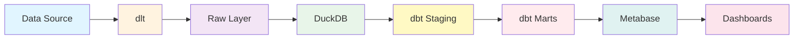

# Dashboards

Build interactive dashboards and visualizations with Metabase.

---

## Overview

Dango includes Metabase, a powerful business intelligence tool that runs automatically when you start your data platform. Query your DuckDB warehouse, build dashboards, and share insights with your team—all through a web interface at http://localhost:3000.

**What Metabase provides**:

- Visual query builder (no SQL required)
- SQL editor for advanced analytics
- Rich visualization library
- Interactive dashboards with filters
- Sharing and collaboration features
- User management and permissions

**What Dango automates**:

- Metabase installation and setup
- DuckDB connection configuration
- Schema synchronization
- Container orchestration

---

## Quick Start

### Access Metabase

Start the Dango platform:

```bash
dango start
```

Open Metabase in your browser:

**http://localhost:3000**

On first launch, create an admin account. Dango has already configured the DuckDB connection for you.

### Your First Dashboard

Create a simple dashboard in 5 minutes:

#### 1. Explore Your Data

```
Home → Browse data → DuckDB → marts
```

Click any table to preview data.

#### 2. Create a Question

```
+ New → Question → Simple question
```

- Table: `marts.customer_metrics`
- Sort: `lifetime_value` descending
- Limit: 10
- Save as "Top Customers"

#### 3. Build a Dashboard

```
+ New → Dashboard
```

- Name: "Customer Overview"
- Add your saved question
- Save and share!

---

## Dashboard Guides

<div class="grid cards" markdown>

-   :material-chart-box-outline: **Metabase Overview**

    ---

    Introduction to Metabase in Dango with auto-configuration and features.

    - First-time admin setup
    - Metabase interface and navigation
    - Available data schemas
    - User management
    - Configuration and settings

    [:octicons-arrow-right-24: Metabase Overview](metabase-overview.md)

-   :material-plus-box: **Creating Dashboards**

    ---

    Step-by-step guide to building interactive dashboards.

    - Creating questions and visualizations
    - Building multi-card dashboards
    - Adding filters and parameters
    - Layout and design best practices
    - Sharing and collaboration

    [:octicons-arrow-right-24: Creating Dashboards](creating-dashboards.md)

-   :material-code-tags: **SQL Queries**

    ---

    Writing SQL queries in Metabase with DuckDB syntax.

    - DuckDB SQL essentials
    - Querying raw, staging, and marts schemas
    - Query variables for interactivity
    - Common analytics patterns
    - Query optimization tips

    [:octicons-arrow-right-24: SQL Queries Guide](sql-queries.md)

</div>

---

## Common Workflows

### Explore Source Data

After syncing a data source:

```bash
dango sync --source stripe_payments
```

View raw data in Metabase:

```
Browse data → DuckDB → raw_stripe → charges
```

Preview Stripe charges directly from dlt ingestion.

### Query Staging Tables

Use auto-generated staging models:

```sql
SELECT * FROM staging.stg_stripe_charges
WHERE status = 'succeeded'
  AND created >= CURRENT_DATE - INTERVAL 7 DAY
ORDER BY created DESC
```

Clean, deduplicated data ready for analysis.

### Build Business Dashboards

Query marts created in dbt:

```sql
SELECT
    month,
    customer_count,
    revenue_usd
FROM marts.monthly_metrics
ORDER BY month DESC
LIMIT 12
```

Create visualizations and combine in dashboards.

---

## Data Flow to Dashboards

Understanding how data reaches Metabase:



1. **Data Source** - API, database, or file
2. **dlt** - Ingestion to DuckDB raw layer
3. **dbt Staging** - Auto-generated cleaned tables (`dango generate`)
4. **dbt Marts** - Custom business logic (`dango run`)
5. **Metabase** - Query, visualize, dashboard
6. **Share** - Dashboards, reports, alerts

---

## Available Data Schemas

Metabase has access to all Dango data layers:

| Schema | Description | When to Query |
|--------|-------------|---------------|
| **raw** | Single-table sources | Debug source data |
| **raw_*** | Multi-table sources (e.g., `raw_stripe`) | Explore raw API data |
| **staging** | Auto-generated staging models | Build custom analytics |
| **intermediate** | Reusable business logic | Advanced analysis |
| **marts** | Analytics-ready tables | **Dashboards (recommended)** |

**Best practice**: Always prefer marts for dashboards. They're pre-aggregated, tested, and optimized.

---

## Key Features

### Visual Query Builder

No SQL required:

1. Choose table
2. Add filters
3. Select aggregations
4. Pick visualization
5. Save and dashboard

Perfect for business users and exploratory analysis.

### SQL Editor

Full DuckDB SQL support:

- Auto-completion
- Schema browser
- Variables for filters
- Export results (CSV, JSON, XLSX)
- Save and organize queries

Ideal for data analysts and complex analytics.

### Visualizations

Rich chart library:

**Basic**:
- Table
- Number (KPI)
- Line chart
- Bar chart
- Pie chart

**Advanced**:
- Funnel
- Gauge
- Map
- Scatter plot
- Waterfall

Customize colors, labels, and formatting.

### Interactive Dashboards

Combine visualizations:

- Multi-card layouts
- Dashboard-wide filters
- Auto-refresh
- Full-screen mode
- Public sharing links
- Email subscriptions

---

## Dashboard Best Practices

### 1. Start with Marts

Always query marts tables for dashboards:

```sql
-- Good: Pre-aggregated mart
SELECT * FROM marts.revenue_by_month

-- Avoid: Aggregating raw data in Metabase
SELECT DATE_TRUNC('month', created), SUM(amount)
FROM raw_stripe.charges
GROUP BY 1
```

**Why**: Faster queries, consistent metrics, tested data.

### 2. Use Meaningful Names

**Questions**:
- "Monthly Revenue Trend" (not "Query 1")
- "Top Customers by LTV" (not "Analysis")

**Dashboards**:
- "Executive Overview"
- "Sales - Weekly Performance"
- "Customer Acquisition Metrics"

### 3. Add Context

Use text cards to explain:

- Dashboard purpose
- Metric definitions
- Data freshness
- Caveats or assumptions

### 4. Keep It Focused

- One dashboard = One purpose
- 6-12 cards maximum
- Group related metrics
- Use sections and headings

### 5. Add Filters

Make dashboards interactive:

- Date range (almost always useful)
- Region/segment filters
- Set sensible defaults

---

## Performance Tips

### Optimize in dbt First

Create aggregated marts:

```sql
-- dbt/models/marts/revenue_by_month.sql
{{ config(materialized='table') }}

SELECT
    DATE_TRUNC('month', created) as month,
    COUNT(*) as transactions,
    SUM(amount / 100.0) as revenue_usd
FROM {{ ref('stg_stripe_charges') }}
WHERE status = 'succeeded'
GROUP BY month
```

Then query in Metabase:

```sql
SELECT * FROM marts.revenue_by_month
ORDER BY month DESC
```

**Result**: Sub-second queries instead of multi-second aggregations.

### Enable Caching

Admin → Settings → Caching

- Cache query results for faster repeated views
- Configurable TTL (time to live)
- Automatic on schema changes

### Limit Data

- Add date filters (default to last 30/90 days)
- Use `LIMIT` for large tables
- Show top N instead of all rows

---

## Sharing and Collaboration

### Internal Sharing

**For Metabase users**:

- Share dashboard links
- Email subscriptions (daily/weekly)
- Slack integrations
- User groups and permissions

### Public Sharing

**External stakeholders**:

- Public links (no login required)
- Embedded dashboards
- PDF/PNG exports

!!! warning "Security"
    Public links expose data without authentication. Use with caution in production.

---

## Data Refresh

### When Data Updates

Metabase queries live data:

```bash
# 1. Sync new source data
dango sync --source stripe_payments

# 2. Run dbt transformations
dango run

# 3. Refresh Metabase dashboard
# Just reload the page - data is already updated!
```

### Schema Changes

When you add new tables or columns:

**Daily auto-sync**: Default at 2 AM

**Manual sync**:

1. Admin → Databases → DuckDB
2. Click "Sync database schema now"
3. New tables/columns appear in 30-60 seconds

---

## Troubleshooting

### Cannot Access Metabase

**Check if running**:

```bash
docker ps | grep metabase
```

**Restart**:

```bash
dango stop
dango start
```

### Table Not Found

**Error**: "Table 'revenue_by_month' not found"

**Solutions**:

1. Add schema prefix: `marts.revenue_by_month`
2. Verify table exists:
   ```bash
   duckdb data/warehouse.duckdb "SHOW TABLES FROM marts;"
   ```
3. Sync Metabase schema (Admin → Databases → Sync)

### Query Timeout

For long-running queries:

1. Optimize in dbt (create aggregated marts)
2. Admin → Databases → DuckDB → Advanced
3. Increase "Query timeout" (default: 30 seconds)

---

## Metabase vs dbt Docs

Both provide data exploration:

| Feature | Metabase | dbt Docs |
|---------|----------|----------|
| **Purpose** | Business intelligence | Technical documentation |
| **Audience** | Business users, analysts | Data engineers |
| **URL** | http://localhost:3000 | http://localhost:8081 |
| **Features** | Dashboards, visualizations | Lineage, SQL code |
| **Queries** | Interactive SQL editor | Read-only |

**Use both**:

- **dbt Docs**: Understand data transformations and lineage
- **Metabase**: Build dashboards and share insights

---

## Backup and Recovery

### Metabase Application Data

Metabase stores dashboards and users in its own database (H2):

**Backup Metabase data**:

```bash
# Docker volume contains Metabase metadata
docker volume ls | grep metabase

# Backup (advanced)
docker run --rm \
  -v metabase_data:/data \
  -v $(pwd):/backup \
  ubuntu tar czf /backup/metabase-backup.tar.gz /data
```

### DuckDB Warehouse

Your actual data lives in DuckDB:

```bash
# Backup warehouse
cp data/warehouse.duckdb data/warehouse-backup-$(date +%Y%m%d).duckdb

# Restore
cp data/warehouse-backup-20241209.duckdb data/warehouse.duckdb
dango start
```

---

## Advanced Topics

### SQL Snippets

Reusable SQL fragments:

1. Admin → SQL Snippets
2. Create snippet: `active_customers`
3. Use in queries:
   ```sql
   SELECT * FROM {{ snippet: active_customers }}
   WHERE created > CURRENT_DATE - 30
   ```

### Metabase Models

Create logical layers in UI:

- Save complex SQL as "Models"
- Business users query Models instead of raw tables
- Similar to dbt models, but defined in Metabase

### Alerts

Set thresholds on metrics:

- Email alerts when values cross thresholds
- Daily/weekly reports
- Requires SMTP configuration

---

## Example Dashboards

### Executive Overview

**Cards**:

1. Current month revenue (Number)
2. Revenue growth % (Number with trend)
3. New customers (Number)
4. Monthly revenue trend (Line chart)
5. Top 10 customers (Table)
6. Revenue by product (Bar chart)

**Filters**: Date range

### Sales Performance

**Cards**:

1. Week-to-date sales (Number)
2. Sales vs. target (Gauge)
3. Daily sales trend (Line)
4. Sales by rep (Bar)
5. Top products (Table)
6. Regional breakdown (Map or Bar)

**Filters**: Date range, region

**Settings**: Auto-refresh 5 minutes

### Customer Analytics

**Cards**:

1. Total customers (Number)
2. Customer acquisition (Line)
3. LTV distribution (Histogram)
4. Cohort retention (Table)
5. Churn rate (Line with goal)
6. Customer segments (Pie)

**Filters**: Date range, segment

---

## Next Steps

<div class="grid cards" markdown>

-   :material-chart-box-outline: **Metabase Overview**

    ---

    Learn about Metabase features, configuration, and best practices.

    [:octicons-arrow-right-24: Metabase Overview](metabase-overview.md)

-   :material-plus-box: **Creating Dashboards**

    ---

    Step-by-step guide to building effective dashboards.

    [:octicons-arrow-right-24: Creating Dashboards](creating-dashboards.md)

-   :material-code-tags: **SQL Queries**

    ---

    Master DuckDB SQL for analytics in Metabase.

    [:octicons-arrow-right-24: SQL Queries Guide](sql-queries.md)

-   :material-application-braces-outline: **Transformations**

    ---

    Create marts tables with dbt for optimal dashboard performance.

    [:octicons-arrow-right-24: Transformations](../transformations/index.md)

-   :material-database-outline: **Data Sources**

    ---

    Connect data sources to populate your dashboards.

    [:octicons-arrow-right-24: Data Sources](../data-sources/index.md)

-   :material-transit-connection-variant: **Core Concepts**

    ---

    Understand Dango's architecture and data flow.

    [:octicons-arrow-right-24: Core Concepts](../core-concepts/index.md)

</div>
