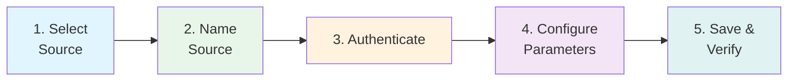
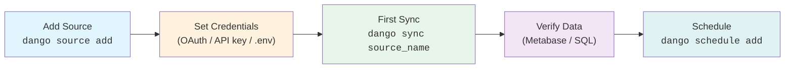

# Adding Sources

How to add and configure data sources in Dango — using the interactive wizard or manual YAML configuration.

---

## Two Paths

| Method | Best For | Command |
|--------|----------|---------|
| **Interactive wizard** | First-time setup, most sources | `dango source add` |
| **Manual YAML** | Automation, advanced config, reproducing setups | Edit `.dango/sources.yml` directly |

The wizard writes the same YAML you'd write by hand — plus it handles credential setup, directory creation, and validation automatically.

---

## Interactive Wizard

### Quick Start

```bash
dango source add
```

The wizard walks you through five steps:



### Step 1: Select Source

Choose from the 25 wizard-enabled sources, displayed in a flat alphabetical list:

```
? Select a data source:
  Airtable
  Apache Kafka
  AWS Kinesis
  Chess.com
  dlt Native (Advanced)
  Email (IMAP)
❯ File Import (CSV, JSON, Parquet)
  Facebook Ads
  Freshdesk
  GitHub
  ...
```

See [Source Catalog](source-catalog.md) for the complete list with auth types and capabilities.

### Step 2: Name Source

Give your source a unique name. Names must be lowercase with underscores only:

```
? Name this File Import source: monthly_reports
```

The wizard shows what will be created:

- Raw schema: `raw_monthly_reports`
- Staging models: `stg_monthly_reports__<table>`

!!! note "Naming conventions"
    Good names describe the data or team: `stripe_production`, `marketing_facebook`, `finance_sheets`. Avoid generic names like `data` or `source1`.

### Step 3: Authenticate

The authentication step varies by source type:

=== "OAuth (Google, Facebook)"

    The wizard opens your browser for OAuth authentication:

    ```
    ? Set up Google Sheets OAuth now? (Recommended) Yes
    → Opening browser for Google authentication...
    ✓ OAuth tokens saved. Expires in 7 days.
    ```

    Tokens are stored in `.dlt/secrets.toml` and auto-refreshed by dlt.

=== "API Key (Stripe, HubSpot, etc.)"

    The wizard prompts for your API key and stores it in `.env`:

    ```
    ? Enter your Stripe API key: sk_live_...
    ✓ Saved to .env as STRIPE_PROD_API_KEY
    ```

    Each source instance gets a unique env var name (e.g., `STRIPE_PROD_API_KEY` for a source named `stripe_prod`).

=== "Basic Auth (Zendesk, MongoDB)"

    The wizard prompts for username/email and password or connection string:

    ```
    ? Enter your Zendesk email: admin@company.com
    ? Enter your Zendesk API token: ...
    ✓ Saved to .env
    ```

=== "No Auth (Chess.com, Kafka, local files)"

    No credentials needed. The wizard skips this step.

### Step 4: Configure Parameters

The wizard prompts for source-specific parameters:

```
? Spreadsheet URL or ID: https://docs.google.com/spreadsheets/d/abc123/edit
? Select sheets to import:
  [x] Sheet1
  [ ] Sheet2
  [x] Revenue
```

Parameters vary by source — the wizard shows help text and defaults for each one.

### Step 5: Save & Verify

The wizard saves your configuration and offers to validate it:

```
✓ Source 'monthly_reports' added to .dango/sources.yml
✓ Directory created: data/uploads/monthly_reports/

Next steps:
  1. Copy your files to data/uploads/monthly_reports/
  2. Run: dango sync monthly_reports
  3. Schedule: dango schedule add monthly_reports
```

### Files Created

The wizard creates or modifies these files:

| File | When | Content |
|------|------|---------|
| `.dango/sources.yml` | Always | Source configuration |
| `.env` | API key / basic auth sources | Credentials (gitignored) |
| `.dlt/secrets.toml` | OAuth sources | OAuth tokens (gitignored) |
| `.dlt/config.toml` | Sources with default config | dlt configuration |
| `data/uploads/{name}/` | File import sources | Upload directory |
| `custom_sources/{module}.py` | dlt_native sources | Python source template |

??? info "REST API wizard flow"
    The REST API source has a guided wizard with extra steps:

    1. **Base URL** — enter your API's base URL (e.g., `https://api.example.com`)
    2. **Auth type** — choose from 6 options:
        - Bearer Token
        - API Key (header or query parameter)
        - HTTP Basic (username + password)
        - OAuth2 Client Credentials
        - Custom Header Token (e.g., `X-Shopify-Access-Token`)
        - No Authentication
    3. **Custom headers** — optional source-level headers (e.g., `API-Version: 2024-01`)
    4. **Endpoints** — add one or more endpoints:
        - Path (e.g., `/orders`)
        - Table name (defaults from path)
        - Query parameters
        - Pagination type (auto-detect, Link header, page number, cursor, offset, or none)
        - Optional endpoint test with auto-detection of data path and primary key
    5. **Review and save**

    This flow generates a complete REST API configuration in `sources.yml` — no Python code needed.

??? info "dlt_native wizard flow"
    The dlt_native source wizard creates a template for advanced users:

    1. **Module name** — Python module name (e.g., `my_api`)
    2. **Function name** — dlt source function name (default: `{module_name}_source`)
    3. **Source name** — name in `sources.yml`
    4. **Template generation** — creates `custom_sources/{module_name}.py` with a starter `@dlt.source` and `@dlt.resource`

    After setup, edit the generated template to implement your data loading logic. See [Custom Sources](custom-sources.md).

---

## Manual Configuration

### sources.yml Structure

Edit `.dango/sources.yml` directly for full control:

```yaml
version: '1.0'
sources:
  - name: stripe_prod
    type: stripe
    enabled: true
    description: "Production Stripe account"
    stripe:
      stripe_secret_key_env: STRIPE_PROD_API_KEY

  - name: marketing_sheets
    type: google_sheets
    enabled: true
    google_sheets:
      spreadsheet_url_or_id: "https://docs.google.com/spreadsheets/d/abc123"
      range_names:
        - "Campaigns"
        - "Budget"

  - name: sales_files
    type: local_files
    local_files:
      directory: data/uploads/sales_files
      file_pattern: "*.csv"
```

### Type-Specific Config Keys

Each source type has its own config section using the source type name (or `generic_config` for sources without a dedicated config model):

```yaml
# Dedicated config model
- name: my_stripe
  type: stripe
  stripe:                    # ← matches type name
    stripe_secret_key_env: STRIPE_API_KEY

# Generic config (most sources)
- name: my_pipedrive
  type: pipedrive
  generic_config:            # ← for sources without dedicated models
    api_key_env: PIPEDRIVE_API_KEY
```

### Common Fields

| Field | Required | Default | Description |
|-------|----------|---------|-------------|
| `name` | Yes | — | Unique identifier (lowercase, underscores) |
| `type` | Yes | — | Source type from [catalog](source-catalog.md) |
| `enabled` | No | `true` | Include in `dango sync` |
| `description` | No | — | Human-readable description |
| `deduplication` | No | — | Strategy: `none`, `latest_only`, `append_only`, `scd_type2` |

### Editing Existing Sources

```bash
# Open sources.yml in your editor
dango source edit

# Open with focus on a specific source
dango source edit stripe_prod
```

The edit command validates YAML syntax before saving.

---

## Managing Sources

### List Sources

=== "CLI"

    ```bash
    # Show all sources with status
    dango source list

    # Show only enabled sources
    dango source list --enabled-only
    ```

    Output includes source name, type, enabled status, last sync time, and row count.

=== "Web UI"

    Navigate to the **Sources** page at `http://localhost:8800/sources` to manage your sources visually. From there you can:

    - View all sources with sync status, row counts, and last sync time
    - Trigger a manual sync with the **Sync Now** button
    - Upload CSV files directly
    - Click into any source for detailed sync history

    See [Web UI — Sources](../web-ui/sources.md) for details.

### Disable a Source

Set `enabled: false` to skip a source during sync without removing its configuration:

```yaml
- name: old_crm
  type: hubspot
  enabled: false  # Skipped during dango sync
```

### Remove a Source

```bash
# Interactive removal with confirmation
dango source remove sales_data

# Skip confirmation
dango source remove sales_data --yes
```

Removal:

- Deletes the source from `sources.yml`
- Cleans up generated dbt staging files (`stg_{name}__*.sql`, `sources_{name}.yml`)
- Offers to clean up related `.env` variables
- Does **not** delete DuckDB tables — run `dango db clean` afterward if needed

---

## Source Lifecycle



1. **Add** — wizard or manual YAML
2. **Credentials** — OAuth flow, API key in `.env`, or connection string
3. **First sync** — `dango sync source_name` loads initial data
4. **Verify** — check data in Metabase or with `dango db query`
5. **Schedule** — set up automated syncs with `dango schedule add`

---

## Troubleshooting

### "Source 'x' already exists"

Source names must be unique. Choose a different name or remove the existing source first:

```bash
dango source remove x
```

### OAuth authentication fails

1. Check your internet connection
2. Ensure the OAuth callback URL is allowed in your Google/Facebook developer console
3. Try re-authenticating: `dango oauth refresh google_sheets`
4. See [OAuth Tokens](../security/oauth.md) for detailed troubleshooting

### "Missing required credential" after wizard

The wizard creates `.env` entries but you may need to fill in the actual values:

```bash
# Check your .env file
cat .env | grep STRIPE

# Edit and fill in your real API key
nano .env
```

### Source syncs but no data appears

1. Verify the source has data: check the source service directly
2. Check sync output for warnings or errors
3. For file sources: verify files are in the correct directory and match the file pattern
4. Run `dango source list` to see the last sync status

### Wizard crashes or exits unexpectedly

Your progress is not saved if the wizard exits before Step 5 (Save). Re-run `dango source add` to start over. The wizard supports going back to previous steps if you need to change something.

---

## Related Pages

- [Source Catalog](source-catalog.md) — all 33 sources with auth types and capabilities
- [Sync Modes](sync-modes.md) — how data is loaded (incremental, full refresh, date range)
- [Deduplication](deduplication.md) — choose a strategy for handling duplicates
- [Local Files](local-files/index.md) — detailed guide for CSV, JSON, and Parquet imports
- [Custom Sources](custom-sources.md) — build integrations with dlt_native
- [Credential Management](../security/credentials.md) — managing API keys and secrets
