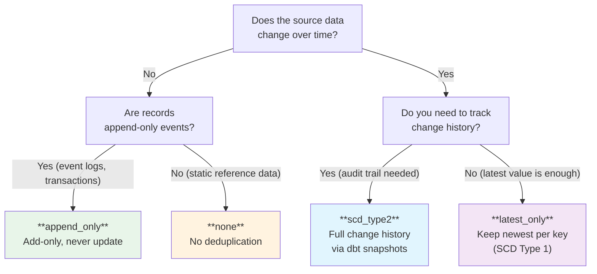

# Deduplication

How Dango handles duplicate records across four deduplication strategies. Choose the right strategy based on whether your data changes over time and whether you need to track that history.

---

## Which Strategy Should I Use?



---

## Strategy Overview

| Strategy | Duplicates | History | Best For | Complexity |
|----------|-----------|---------|----------|------------|
| `none` | Kept as-is | All records preserved | Fact tables, event logs | Lowest |
| `latest_only` | Replaced with newest | No history (SCD Type 1) | CRM contacts, product catalogs | Low |
| `append_only` | Never updated | Immutable record | Transactions, audit logs | Low |
| `scd_type2` | Versioned with timestamps | Full change history | Price tracking, status changes | Medium |

---

## Strategies in Detail

### `none` — No Deduplication

All records are kept exactly as loaded. No deduplication logic is applied.

```yaml
sources:
  - name: event_logs
    type: local_files
    local_files:
      directory: data/uploads/event_logs
    deduplication: none
```

**When to use:**

- Event/fact tables where every record is unique by nature
- Append-only logs where duplicates don't occur
- Sources where you handle deduplication in custom dbt models

**What happens:** Data is loaded directly into the raw layer. The staging model passes records through without modification.

---

### `latest_only` — Keep Newest Per Key (SCD Type 1)

When multiple records share the same primary key, only the most recent version is kept. This is the default for Google Sheets sources.

```yaml
sources:
  - name: customer_list
    type: google_sheets
    deduplication: latest_only
```

**When to use:**

- Dimension tables that get overwritten with current values
- Google Sheets used as a "current state" reference
- Sources where you only care about the latest version of each record

**What happens:** The staging model includes a `ROW_NUMBER()` window function partitioned by the primary key, ordered by the update timestamp descending. Only the first row (most recent) per key is kept.

**Requirements:** The source must have both a primary key column (e.g., `id`) and an update timestamp column (e.g., `updated_at`).

---

### `append_only` — Add-Only, Never Update

Records are only ever inserted, never updated or deleted. Each sync appends new records without modifying existing ones.

```yaml
sources:
  - name: transactions
    type: stripe
    deduplication: append_only
```

**When to use:**

- Immutable event streams (payments, page views, sensor readings)
- Data where historical accuracy is critical and records should never change
- Sources that naturally produce append-only data

**What happens:** The staging model passes all records through. dlt's incremental loading ensures only new records are fetched on each sync.

---

### `scd_type2` — Full Change History via dbt Snapshots

Tracks every change to a record over time using dbt snapshots. Each version of a record gets `dbt_valid_from` and `dbt_valid_to` timestamps showing when that version was active.

```yaml
sources:
  - name: product_prices
    type: dlt_native
    deduplication: scd_type2
```

**When to use:**

- Price tracking (what was the price on a given date?)
- Status tracking (when did this order move to "shipped"?)
- Compliance/audit requirements (prove what the data looked like at a point in time)

**What happens:** Dango generates a dbt snapshot file that compares the current source data against the previous snapshot. Changed records get a new version row, and the old version's `dbt_valid_to` is set to the current timestamp.

**Generated columns:**

| Column | Description |
|--------|-------------|
| `dbt_valid_from` | When this version of the record became active |
| `dbt_valid_to` | When this version was superseded (NULL = current) |
| `dbt_scd_id` | Unique identifier for this version |
| `dbt_updated_at` | When the snapshot was executed |

**Query example — get the current version:**

```sql
SELECT *
FROM snapshots.snp_product_prices
WHERE dbt_valid_to IS NULL;
```

**Query example — get the value at a specific date:**

```sql
SELECT *
FROM snapshots.snp_product_prices
WHERE dbt_valid_from <= '2026-03-15'
  AND (dbt_valid_to > '2026-03-15' OR dbt_valid_to IS NULL);
```

??? info "Snapshot configuration details"
    The generated snapshot uses dbt's `timestamp` strategy by default, requiring a `unique_key` and `updated_at` column. If no timestamp column is available, the `check` strategy is used instead (compares all columns for changes).

    Snapshots are stored in the `snapshots` schema in DuckDB and run automatically during `dango sync` as part of the dbt execution.

    See [Snapshots (SCD Type 2)](../transformations/snapshots.md) for the full dbt snapshot guide.

---

## Configuration

Set the deduplication strategy in your `sources.yml`:

```yaml
sources:
  - name: my_source
    type: stripe
    deduplication: latest_only  # none | latest_only | append_only | scd_type2
```

If no `deduplication` field is specified, Dango uses sensible defaults:

- **Google Sheets:** `latest_only` (sheets are typically current-state reference data)
- **All other sources:** No deduplication applied (data loaded as-is)

---

## Auto-Inference

When generating staging models, Dango can automatically infer a deduplication strategy based on column patterns:

1. If the table has an `updated_at` or `modified_at` column **and** an ID column (`id`, `uuid`, `key`), Dango suggests `last_modified` deduplication in the staging model
2. Otherwise, no deduplication is applied

This auto-inference only affects auto-generated staging models. You can always override it by setting `deduplication` explicitly in `sources.yml` or editing the generated staging SQL.

---

## Strategy Comparison

| Aspect | `none` | `latest_only` | `append_only` | `scd_type2` |
|--------|--------|---------------|---------------|-------------|
| Duplicate handling | Kept | Replaced | Prevented by cursor | Versioned |
| Historical data | All records | Latest only | All records | All versions |
| Storage growth | Linear | Bounded | Linear | Higher (versions) |
| Query complexity | Simple | Simple | Simple | Moderate |
| dbt model type | Staging | Staging (window fn) | Staging | Snapshot |
| Requires primary key | No | Yes | No | Yes |
| Requires timestamp | No | Yes | No | Recommended |

---

## Related Pages

- [Sync Modes](sync-modes.md) — incremental vs full refresh and how data is loaded
- [Staging Models](../transformations/staging-models.md) — how deduplication is applied in auto-generated models
- [Snapshots (SCD Type 2)](../transformations/snapshots.md) — full guide to dbt snapshots
- [Adding Sources](adding-sources.md) — set up a source and choose its deduplication strategy
