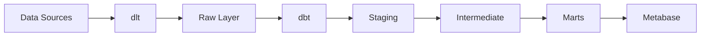

# What is Dango?

Dango is an open-source data platform that integrates production-grade tools (dlt, dbt, DuckDB, Metabase) into a single, cohesive platform.

**Works on your laptop today. Designed to scale to production tomorrow.**

## The Problem

Building a data platform typically requires:

- Weeks of setup and configuration
- Deep knowledge of multiple tools
- Complex infrastructure decisions
- Choosing between simple (limited) or complex (powerful) tools

**Result:** Data teams spend more time on infrastructure than analysis.

## The Solution

Dango gives you a complete data stack with one command:

```bash
dango init
```

You get:

- **dlt** for data ingestion (29+ verified sources)
- **dbt** for SQL transformations
- **DuckDB** as your analytics database
- **Metabase** for dashboards and SQL queries
- **Web UI** for monitoring and management

## Architecture

Dango uses a layered data architecture:



### Data Layers

1. **Raw** - Immutable source of truth with metadata
2. **Staging** - Clean, deduplicated data
3. **Intermediate** - Reusable business logic
4. **Marts** - Final business metrics

### Tech Stack

| Component | Purpose | Why This Tool? |
|-----------|---------|----------------|
| **DuckDB** | Analytics database | Embedded, fast, no server needed |
| **dlt** | Data ingestion | 29+ sources, schema evolution |
| **dbt** | Transformations | SQL-based, version controlled |
| **Metabase** | BI dashboards | Auto-configured, easy to use |
| **Docker** | Service orchestration | Consistent environments |
| **FastAPI** | Web UI backend | Fast, modern Python |

## Core Features

### Data Ingestion

- 29+ verified dlt sources (Stripe, Google Sheets, GA4, Facebook Ads, etc.)
- CSV upload and auto-sync
- Custom source development
- OAuth authentication for cloud sources

### Transformations

- dbt auto-generation for staging models
- Full dbt project access
- SQL-based transformations
- Incremental model support

### Monitoring

- Web UI with live pipeline status
- File watcher with auto-triggers
- Token expiry warnings
- Validation and health checks

### Dashboards

- Metabase auto-configured with DuckDB
- Pre-built dashboard templates
- SQL query interface
- Dashboard backup and restore

## Current Status: v0.0.5 (MVP)

### What Works Now

- ✅ Full CLI with 10+ commands
- ✅ CSV, Stripe, Google Sheets, GA4, Facebook Ads sources
- ✅ dbt auto-generation for staging models
- ✅ Web UI with live monitoring
- ✅ Metabase dashboards
- ✅ File watcher with auto-triggers
- ✅ Custom sources via `dlt_native` type

### Coming Soon

- 🚧 **v0.1.0**: Google Ads, demo project, full documentation
- 🔮 **Beyond v0.1.0**: Cloud deployment guides, advanced scheduling, team collaboration

## Design Philosophy

Dango is built chronologically - starting with local support for MVP, designed to scale to cloud production later.

### Why This Approach?

1. **Get started fast** - No cloud infrastructure needed
2. **Learn the tools** - Master dlt, dbt, and SQL locally
3. **Scale when ready** - Same tools, bigger infrastructure
4. **Production-grade** - Best practices from day one

## Target Users

- **Solo data professionals** - Complete stack, zero complexity
- **Fractional consultants** - Fast client onboarding
- **SMEs** - Analytics without engineering teams
- **Learners** - Production tools without production costs

## Why Dango vs. Alternatives?

### vs. Cloud Platforms (Snowflake, BigQuery)

| Dango | Cloud Platforms |
|-------|-----------------|
| ✅ Free (open source) | ❌ Pay per query |
| ✅ Runs on laptop | ❌ Requires cloud account |
| ✅ Fast iteration | ⚠️ Can be slow/expensive during dev |
| ⚠️ Local compute limits | ✅ Scales to petabytes |

### vs. No-Code Tools (Fivetran, Airbyte Cloud)

| Dango | No-Code Tools |
|-------|---------------|
| ✅ Fully customizable | ❌ Limited customization |
| ✅ Version controlled | ⚠️ UI-based configuration |
| ✅ Open source | ❌ Proprietary/paid |
| ⚠️ Requires code for complex cases | ✅ Point-and-click simple cases |

### vs. DIY Stack

| Dango | DIY Stack |
|-------|-----------|
| ✅ Integrated from day one | ❌ Weeks of integration work |
| ✅ Best practices built-in | ⚠️ Easy to make mistakes |
| ✅ Maintained by community | ❌ You maintain everything |
| ⚠️ Opinionated structure | ✅ Complete flexibility |

## What Dango is NOT

- **Not a SaaS platform** - It's a CLI tool that runs locally
- **Not cloud-only** - MVP is local, cloud support coming later
- **Not a BI tool** - It integrates BI (Metabase) but focuses on data infrastructure
- **Not production-ready for enterprise** - Currently MVP (v0.0.5)

## Next Steps

Ready to try Dango?

1. **[Install Dango](installation.md)** - Get set up in minutes
2. **[Quick Start](quick-start.md)** - Run your first pipeline
3. **[Core Concepts](../core-concepts/index.md)** - Deep dive into architecture

## Questions?

- **GitHub**: [github.com/getdango/dango](https://github.com/getdango/dango)
- **Issues**: [github.com/getdango/dango/issues](https://github.com/getdango/dango/issues)
- **PyPI**: [pypi.org/project/getdango](https://pypi.org/project/getdango/)
