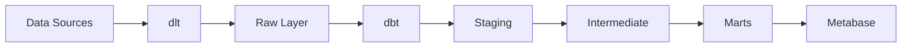

# What is Dango?

Dango is an open-source data platform that integrates production-grade tools (dlt, dbt, DuckDB, Metabase) into a single, cohesive platform.

**Develop locally. Deploy to the cloud when you're ready.**

## The Problem

Building a data platform typically requires:

- Weeks of setup and configuration
- Deep knowledge of multiple tools
- Complex infrastructure decisions
- Choosing between simple (limited) or complex (powerful) tools

**Result:** Data teams spend more time on infrastructure than analysis.

## The Solution

Dango gives you a complete data stack with one command:

```bash
dango init
```

You get:

- **dlt** for data ingestion (35 data sources)
- **dbt** for SQL transformations
- **DuckDB** as your analytics database
- **Metabase** for dashboards and SQL queries
- **Web UI** for monitoring, management, and authentication
- **50+ CLI commands** for every aspect of your data workflow

## Architecture

Dango uses a layered data architecture:


```mermaid
graph LR
    A[Data Sources] --> B[dlt]
    B --> C[Raw Layer]
    C --> D[dbt]
    D --> E[Staging]
    E --> F[Intermediate]
    F --> G[Marts]
    G --> H[Metabase]
```

### Data Layers

1. **Raw** — Immutable source of truth with metadata
2. **Staging** — Clean, deduplicated data
3. **Intermediate** — Reusable business logic
4. **Marts** — Final business metrics

Learn more in [Data Layers](../core-concepts/data-layers.md).

### Tech Stack

| Component | Purpose | Why This Tool? |
|-----------|---------|----------------|
| **DuckDB** | Analytics database | Embedded, fast, no server needed |
| **dlt** | Data ingestion | 35 sources, schema evolution |
| **dbt** | Transformations | SQL-based, version controlled |
| **Metabase** | BI dashboards | Auto-configured, easy to use |
| **Docker** | Service orchestration | Consistent environments |
| **FastAPI** | Web UI backend | Fast, modern Python |

## Core Features

### Data Ingestion

- 35 data sources (Stripe, Google Sheets, GA4, Facebook Ads, Salesforce, HubSpot, and more)
- File import for CSV, JSON, and Parquet files
- Custom source development via `dlt_native` and REST API types
- OAuth authentication for cloud sources

Learn more in [Data Sources](../data-sources/index.md).

### Transformations

- dbt auto-generation for staging models
- Full dbt project access with custom models
- SQL-based transformations
- Incremental model support
- Branch-based development with `dango dev`

Learn more in [Transformations](../transformations/index.md).

### Monitoring & Scheduling

- Web UI with live pipeline status and sync history
- Scheduled syncs with flexible cron expressions
- Schema drift detection with automatic alerts
- Webhook notifications (Slack, email, custom endpoints)
- Health monitoring with capacity tracking
- Token expiry warnings for OAuth sources

Learn more in [Scheduling & Monitoring](../scheduling-monitoring/index.md).

### Authentication & Security

- Authentication enabled by default — configured automatically during `dango init`
- Session-based auth with configurable timeouts
- Admin password management via CLI and Web UI
- Metabase SSO bridge — access dashboards through the Web UI without a separate login
- Credential encryption for source secrets
- Audit logging for security events

Learn more in [Security](../security/index.md).

### Governance

- Automated PII scanning across your data warehouse
- Column-level descriptions synced to Metabase
- Data catalog with schema documentation
- dbt test integration for data quality monitoring

Learn more in [Data Catalog](../scheduling-monitoring/data-catalog.md) and [PII Scanning](../scheduling-monitoring/pii-scanning.md).

### Notebooks

- Marimo notebook integration for interactive data exploration
- Read-only DuckDB snapshots to avoid write locks
- Built-in templates for common analysis patterns

Learn more in [Notebooks](../notebooks/index.md).

### Dashboards

- Metabase auto-configured with DuckDB
- Pre-built pipeline health dashboard (`dango dashboard provision`)
- SQL query interface
- Dashboard backup and restore (`dango metabase save` / `dango metabase load`)

Learn more in [Dashboards](../dashboards/index.md).

### Cloud Deployment

- One-command deployment to any server via SSH
- DigitalOcean provisioning with `dango deploy`
- Bring Your Own Server (BYOS) support
- Automatic TLS via Caddy, fail2ban, unattended upgrades
- Push-based deployment model with `dango remote push`

Learn more in [Deployment](../deployment/index.md).

## Design Philosophy

Dango is built on two core principles:

### Opinionated but Modular

Best practices are built in so you can focus on insights, not infrastructure. As the open-source data ecosystem evolves, components can be swapped for better alternatives without rebuilding your entire stack.

### Democratize Analytics Infrastructure

Enterprise-grade data tooling shouldn't require a dedicated platform team. Dango brings production-quality patterns to teams of any size — the same tools used by sophisticated data teams, packaged for accessibility.

## Target Users

- **Solo data professionals** — Complete stack, zero complexity
- **Small data teams** — Full analytics stack that grows with you
- **Fractional consultants** — Fast client onboarding
- **SMEs** — Analytics infrastructure without the overhead
- **Learners** — Production tools without production costs

## Why Dango vs. Alternatives?

### vs. Cloud Platforms (Snowflake, BigQuery)

| Aspect | Dango | Cloud Platforms |
|--------|-------|-----------------|
| **Setup** | One command, ready in minutes | Assemble and integrate multiple tools |
| **Cost** | Free and open source | Pay for compute and storage |
| **Stack** | Integrated (dlt + dbt + DuckDB + Metabase) | Build your own toolchain |
| **Iteration** | Instant local feedback loop | Round-trip to cloud for each change |
| **Deployment** | Local or self-hosted cloud | Managed cloud only |
| **Scale** | Local compute or single server | Scales to petabytes |

### vs. Managed ETL Tools (Fivetran, Airbyte Cloud)

| Aspect | Dango | Managed ETL Tools |
|--------|-------|-------------------|
| **Customization** | Fully customizable | Limited to supported connectors |
| **Configuration** | Version controlled (YAML, SQL) | UI-based, harder to track changes |
| **Cost** | Free and open source | Subscription or usage-based pricing |
| **Integration** | Complete stack included | ETL only — BI, transforms, warehouse separate |
| **Complexity** | Requires some code for advanced use | Point-and-click for supported sources |

!!! note
    Some tools like Airbyte have open-source versions, but require separate setup for orchestration, transformations, and BI.

### vs. DIY Stack

| Dango | DIY Stack |
|-------|-----------|
| ✅ Integrated from day one | ❌ Weeks of integration work |
| ✅ Best practices built in | ⚠️ Easy to make mistakes |
| ✅ Maintained by community | ❌ You maintain everything |
| ⚠️ Opinionated structure | ✅ Complete flexibility |

## What Dango is NOT

- **Not a SaaS platform** — It's a CLI tool you run locally or on your own server
- **Not cloud-only** — Develop locally first, deploy to the cloud when you're ready
- **Not a BI tool** — It integrates BI (Metabase) but focuses on data infrastructure
- **Not a petabyte-scale warehouse** — Designed for small-to-medium datasets on DuckDB

## Next Steps

Ready to try Dango?

1. **[Install Dango](installation.md)** — Get set up in minutes
2. **[Quick Start](quick-start.md)** — Run your first pipeline
3. **[Your First Dashboard](first-dashboard.md)** — Build a Metabase dashboard
4. **[Core Concepts](../core-concepts/index.md)** — Deep dive into architecture

## Questions?

- **GitHub**: [github.com/getdango/dango](https://github.com/getdango/dango)
- **Issues**: [github.com/getdango/dango/issues](https://github.com/getdango/dango/issues)
- **PyPI**: [pypi.org/project/getdango](https://pypi.org/project/getdango/)
