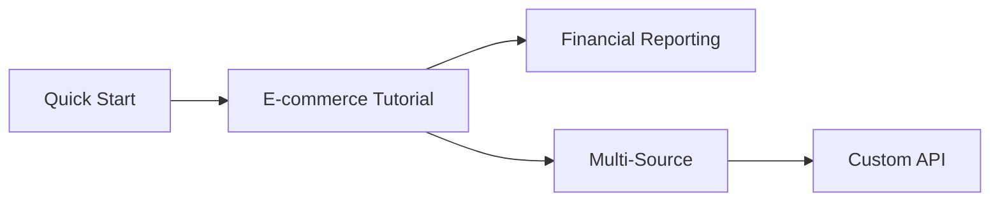

# Guides & Tutorials

Practical, end-to-end tutorials for real-world analytics use cases.

---

## Overview

These guides walk through complete workflows using Dango. Each tutorial is designed to be followed from start to finish, demonstrating realistic data scenarios.

---

## Available Tutorials

-   :material-cart: **E-commerce Analytics**

    ---

    Build a complete e-commerce analytics pipeline with CSV orders and Stripe payments.

    **Duration**: ~30 minutes

    [:octicons-arrow-right-24: Start Tutorial](ecommerce-tutorial.md)

-   :material-finance: **Financial Reporting**

    ---

    Create financial dashboards with Stripe revenue data and dbt transformations.

    **Duration**: ~20 minutes

    [:octicons-arrow-right-24: Start Tutorial](financial-reporting.md)

-   :material-source-merge: **Multi-Source Integration**

    ---

    Combine data from multiple sources into unified analytics.

    **Duration**: ~25 minutes

    [:octicons-arrow-right-24: Start Tutorial](multi-source.md)

-   :material-api: **Custom API Integration**

    ---

    Build a custom data source for any REST API.

    **Duration**: ~30 minutes

    [:octicons-arrow-right-24: Start Tutorial](custom-api.md)

---

## Prerequisites

Before starting any tutorial, ensure you have:

- [x] Dango installed (`pip install getdango`)
- [x] A Dango project initialized (`dango init`)
- [x] Docker running (for Metabase)
- [x] Basic familiarity with SQL

---

## Tutorial Approach

Each guide follows this structure:

1. **Setup** - Create project and configure sources
2. **Ingest** - Sync data into DuckDB
3. **Transform** - Build dbt models
4. **Visualize** - Create dashboards in Metabase
5. **Iterate** - Add more sources or transformations

---

## Recommended Learning Path

| Experience | Start With |
|------------|------------|
| **New to Dango** | [Quick Start](../getting-started/quick-start.md) → E-commerce Tutorial |
| **Know the basics** | Financial Reporting or Multi-Source |
| **Advanced user** | Custom API Integration |

---

## Sample Data

Some tutorials use sample data. Download links are provided in each tutorial, or use your own data for a more realistic experience.

!!! tip "Use Your Own Data"
    These tutorials work best with real data. If you have access to a Stripe test account or can export your own CSVs, use those instead of sample files.

---

## Getting Help

If you get stuck:

1. Check the [Troubleshooting Guide](../workflows/troubleshooting.md)
2. Review the relevant section docs (Data Sources, Transformations, etc.)
3. Ask in [GitHub Discussions](https://github.com/getdango/dango/discussions)
