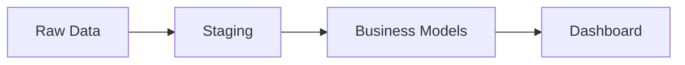

# Migration from Spreadsheets

Move your team from spreadsheet-based reporting to a proper analytics pipeline.

---

## What You'll Build

By the end of this tutorial, you'll have:

- CSV exports imported into DuckDB (a fast analytics database)
- Data organized into clean layers (raw → staging → business models)
- A live dashboard replacing your spreadsheet reports
- A path to automated refresh

**Duration**: ~25 minutes

---

## Why Migrate?

| Spreadsheets | Dango |
|-------------|-------|
| Manual copy-paste updates | Automated data syncs |
| Conflicting versions across team | Single source of truth |
| VLOOKUP breaks at scale | SQL joins across any data |
| No access control | Role-based permissions |
| Formula spaghetti | Documented, testable transformations |
| Charts tied to one file | Shared, interactive dashboards |

---

## Prerequisites

- Dango installed (`pip install getdango`)
- Docker running (for Metabase, the visualization tool)
- One or more CSV exports from your spreadsheets
- Basic SQL knowledge (we'll guide you through it)

---

## Step 1: Export Your Spreadsheets

### From Google Sheets

1. Open your spreadsheet
2. **File** → **Download** → **Comma Separated Values (.csv)**
3. For multi-tab spreadsheets, download each tab separately

### From Excel

1. Open your workbook
2. **File** → **Save As** → choose **CSV UTF-8** format
3. Save each sheet as a separate CSV

!!! tip "Multi-Tab Spreadsheets"
    Name your CSV files descriptively: `sales_2024.csv`, `customers.csv`, `products.csv`. Each file becomes a separate table in your database.

---

## Step 2: Create a Dango Project

```bash
# Create a new project
dango init my-analytics
cd my-analytics

# Start services (DuckDB warehouse + Metabase for dashboards)
dango start
```

!!! note "Authentication"
    `dango init` prompts you to set an admin password. This secures your web UI and dashboards. See [Authentication](../security/authentication.md) for details.

---

## Step 3: Import CSV Files

### Add a File Import Source

Run the interactive wizard:

```bash
dango source add
```

When prompted:

1. Select **File Import** from the source categories
2. **Source name**: `my_data` (or something descriptive like `sales_data`)
3. **Directory**: `data/uploads`
4. **File pattern**: `*.csv`

### Copy Your CSVs

```bash
mkdir -p data/uploads
cp ~/Downloads/sales_2024.csv data/uploads/
cp ~/Downloads/customers.csv data/uploads/
cp ~/Downloads/products.csv data/uploads/
```

### Sync to Database

```bash
dango sync
```

This loads each CSV as a table in DuckDB. Verify the import:

```bash
dango db status
```

You should see tables like `raw_my_data.sales_2024`, `raw_my_data.customers`, etc.

??? info "What is DuckDB?"
    DuckDB is a fast, embedded analytics database. Think of it as a SQLite designed for analytical queries. It runs locally — no server to manage — and handles millions of rows efficiently.

---

## Step 4: Understand Data Layers

Dango organizes data into layers, similar to how you might separate raw data from summary sheets in a spreadsheet:



| Layer | Purpose | Spreadsheet Equivalent |
|-------|---------|----------------------|
| **Raw** | Exact copy of source data | Your original CSV data |
| **Staging** | Cleaned, renamed, typed | A "clean" copy of each sheet |
| **Business Models** | Calculations, joins, metrics | Summary/pivot sheets, VLOOKUP sheets |

See [Data Layers](../core-concepts/data-layers.md) for a deeper explanation.

---

## Step 5: Explore Auto-Generated Staging Models

After syncing, Dango auto-generates staging models that clean your raw data:

```bash
ls dbt/models/staging/
```

Each staging model:

- Renames columns to `snake_case`
- Casts types (dates, numbers)
- Filters out empty rows

??? info "What is dbt?"
    dbt (data build tool) transforms data using SQL. Instead of writing formulas across cells, you write SQL queries that produce new tables. Each query is a "model" — a reusable, testable building block.

---

## Step 6: Build Business Models

This is where you replace your spreadsheet formulas with SQL. Create models in `dbt/models/marts/`.

### Example: Monthly Sales Summary

If your spreadsheet had a pivot table summarizing sales by month, replace it with:

```sql
-- dbt/models/marts/fct_monthly_sales.sql
{{ config(materialized='table') }}

with sales as (
    select * from {{ ref('stg_my_data_sales_2024') }}
)

select
    date_trunc('month', sale_date::date) as month,
    count(*) as total_orders,
    sum(amount) as total_revenue,
    avg(amount) as avg_order_value,
    count(distinct customer_id) as unique_customers
from sales
group by 1
order by 1
```

### Example: Customer Summary

Replace your VLOOKUP-based customer sheet:

```sql
-- dbt/models/marts/dim_customer_summary.sql
{{ config(materialized='table') }}

with customers as (
    select * from {{ ref('stg_my_data_customers') }}
),

sales as (
    select * from {{ ref('stg_my_data_sales_2024') }}
)

select
    c.customer_id,
    c.name,
    c.email,
    c.region,
    count(s.order_id) as total_orders,
    coalesce(sum(s.amount), 0) as lifetime_value,
    min(s.sale_date) as first_purchase,
    max(s.sale_date) as last_purchase
from customers c
left join sales s using (customer_id)
group by 1, 2, 3, 4
```

### Run Models

```bash
dango run
```

!!! tip
    `dango run` executes `dbt build`, which runs both your models and any data quality tests in dependency order.

---

## Step 7: Create Your First Dashboard

Open the Dango web UI at [http://localhost:8800](http://localhost:8800) and log in with your admin credentials. Navigate to **Metabase** via the sidebar.

??? info "What is Metabase?"
    Metabase is an open-source business intelligence tool. It connects to your DuckDB database and lets you create charts, tables, and dashboards — no code required.

### Create Questions

**Monthly Revenue** (Line chart):

1. Click **+ New** → **Question** → **Native query**
2. Enter:
```sql
SELECT month, total_revenue, total_orders
FROM fct_monthly_sales
ORDER BY month
```
3. Click **Visualize** → choose **Line** chart
4. Save as "Monthly Revenue"

**Top Customers** (Table):

1. **+ New** → **Question** → **Native query**
2. Enter:
```sql
SELECT name, region, total_orders, lifetime_value
FROM dim_customer_summary
ORDER BY lifetime_value DESC
LIMIT 20
```
3. Save as "Top Customers"

**Key Metrics** (Number cards):

1. **+ New** → **Question** → **Native query**
2. Enter:
```sql
SELECT
    sum(total_revenue) as "Total Revenue",
    sum(total_orders) as "Total Orders",
    avg(avg_order_value) as "Avg Order Value"
FROM fct_monthly_sales
```
3. Save as "Key Metrics"

### Build Dashboard

1. **+ New** → **Dashboard**
2. Name it "Sales Overview"
3. Add your saved questions
4. Drag to arrange:

```
┌─────────────────────────────────────────┐
│  Total Revenue  │  Total Orders  │  AOV │
├─────────────────────────────────────────┤
│  Monthly Revenue (Line chart)           │
├─────────────────────────────────────────┤
│  Top Customers (Table)                  │
└─────────────────────────────────────────┘
```

---

## Step 8: Set Up Ongoing Imports

### Manual Refresh

When you get new CSV exports, drop them into `data/uploads/` and re-sync:

```bash
cp ~/Downloads/sales_2025_q1.csv data/uploads/
dango sync
dango run
```

Your dashboard updates automatically.

### Connect Google Sheets Directly

Instead of exporting CSVs, connect Google Sheets as a live source:

```bash
# Authenticate with Google
dango oauth google_sheets

# Add via source wizard (select Google Sheets)
dango source add
```

See [Google Sheets](../data-sources/google-sheets.md) for setup details.

### Schedule Automatic Syncs

For data that updates regularly:

```bash
dango schedule add
```

The wizard walks you through setting up daily or weekly syncs. See [Scheduled Syncs](../scheduling-monitoring/scheduled-syncs.md) for details.

---

## Step 9: Share with Your Team

Once your dashboard is ready, add team members so they can view it too:

```bash
# Add a viewer (can see dashboards, can't change data)
dango auth add-user colleague@yourcompany.com --role viewer
```

Share the invite link with your team. See [Team Setup](team-setup.md) for the full guide on roles and permissions.

---

## Spreadsheet vs Dango Reference

| Spreadsheet | Dango (SQL) | Example |
|-------------|-------------|---------|
| `VLOOKUP(A2, Sheet2!A:B, 2)` | `JOIN ... USING (key)` | `FROM sales JOIN customers USING (customer_id)` |
| Pivot table | `GROUP BY` | `SELECT region, sum(amount) GROUP BY region` |
| `SUMIFS(range, criteria)` | `SUM(CASE WHEN ...)` | `sum(case when status = 'paid' then amount end)` |
| `COUNTIF(range, ">100")` | `COUNT + CASE WHEN` | `count(case when amount > 100 then 1 end)` |
| `IF(A1>0, "Yes", "No")` | `CASE WHEN` | `case when amount > 0 then 'Yes' else 'No' end` |
| `TEXT(date, "YYYY-MM")` | `date_trunc` | `date_trunc('month', sale_date)` |
| `UNIQUE(range)` | `DISTINCT` | `select distinct customer_id from sales` |
| Copy sheet for backup | `dango snapshot db` | Point-in-time copy of your database |
| Share via email | Role-based access | `dango auth add-user ... --role viewer` |

---

## Summary

You've migrated from spreadsheets to a proper analytics pipeline:

- [x] CSV data imported into DuckDB
- [x] Data organized into clean layers
- [x] SQL models replacing spreadsheet formulas
- [x] Interactive dashboard replacing static charts
- [x] Path to automated refresh and team sharing

### What's Different Now

- **One source of truth** — no more conflicting spreadsheet versions
- **Automatic updates** — sync new data without copy-paste
- **Testable logic** — SQL models can be validated, unlike hidden formulas
- **Team access** — role-based permissions instead of sharing files
- **Scales** — handles millions of rows without slowdown

---

## Next Steps

- [E-commerce Tutorial](ecommerce-tutorial.md) - Build a more complex pipeline
- [Team Setup](team-setup.md) - Add team members with roles
- [Google Sheets](../data-sources/google-sheets.md) - Connect sheets directly instead of CSV exports
- [Scheduled Syncs](../scheduling-monitoring/scheduled-syncs.md) - Automate data refresh
