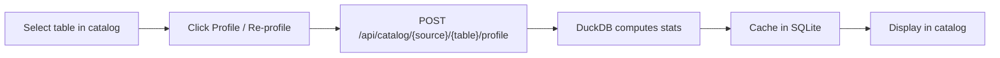

# Data Catalog

A centralized metadata browser for exploring your dbt models, column schemas, data profiling statistics, lineage graphs, and full-text search — all from the Web UI.

---

## Overview

The data catalog gives you a single place to answer questions about your data:

- **What tables exist?** Browse all dbt models organized by layer (staging, intermediate, marts)
- **What does each column contain?** View schema, profiling stats, and PII flags
- **Where does data flow?** Trace lineage from raw sources through transformations to final models
- **What depends on this model?** Impact analysis shows downstream dependencies before you make changes
- **Find anything:** Full-text search across model names, descriptions, and column names

The catalog is powered by your dbt manifest (for model metadata and lineage) and DuckDB introspection (for column schemas and profiling).

## How It Works

### Browsing Models & Sources

The catalog lists all dbt models from your project, classified into layers: **staging**, **intermediate**, and **marts**. Classification uses schema name first, then name prefix, with a fallback to intermediate. See [Model Classification Rules](#model-classification-rules) for the full priority table.

Raw source tables (in `raw_*` schemas) are also browsable — they appear under their source name, even if they aren't yet referenced in dbt models.

### Model Detail View

Click any model to see:

- **Description** from dbt YAML documentation
- **Materialization** type (view, table, incremental)
- **Column schema** with types from DuckDB
- **dbt tests** attached to the model (with pass/fail status)
- **Raw SQL** and **compiled SQL** from the dbt manifest
- **Upstream and downstream lineage**

### Column Metadata

Each column shows:

- **Name and type** from DuckDB's `information_schema.columns`
- **Description** from dbt YAML documentation (if documented)
- **Profiling statistics** (if profiled — see below)
- **PII flags** from [PII scanning](pii-scanning.md) (if detected)

Column types come directly from DuckDB, so you see the actual storage type (e.g., `VARCHAR`, `BIGINT`, `TIMESTAMP WITH TIME ZONE`) rather than the source system's type.

### Profiling

Profiling computes summary statistics for each column in a table. Statistics are computed in DuckDB and cached in SQLite for fast retrieval.



Profiling computes statistics appropriate to each column type:

- **All columns:** null count, distinct count
- **Numeric columns:** min, max, average, median
- **String columns:** min length, max length, average length

!!! tip "Re-profile after schema changes"
    Profiling results are cached. If the table schema changes (new columns, type changes), click **Re-profile** to refresh the statistics.

### Lineage

Lineage shows how data flows through your dbt project — from raw source tables through staging and intermediate models to final marts.

The lineage graph is built from the dbt manifest's dependency information (`depends_on` and `child_map`).

**Example trace:**

```
raw_stripe.charges
  → stg_stripe_charges (staging)
    → int_customer_orders (intermediate)
      → fct_customer_ltv (marts)
```

### Impact Analysis

Before modifying a model, use impact analysis to see what depends on it. This is the reverse of the lineage graph — it shows all downstream models that would be affected by changes.

**Example:** Before changing `stg_stripe_charges`, impact analysis shows:

```
stg_stripe_charges
  ← int_customer_orders
    ← fct_customer_ltv
    ← fct_daily_revenue
  ← int_refund_analysis
    ← fct_refund_summary
```

!!! warning "Check impact before modifying models"
    Always review the impact analysis before changing a model's schema or logic. Downstream models may break if you rename columns or change aggregations.

### Search

Search across the entire catalog — model names, descriptions, and column names:

- **Up to 50 results** returned per search
- **Ranking:** Name matches rank highest, then description matches, then column name matches
- **Minimum query length:** 2 characters

**Example searches:**

| Query | Finds |
|-------|-------|
| `orders` | Models named `stg_orders`, `fct_orders`, columns named `order_id` |
| `revenue` | Models with "revenue" in their name or description |
| `email` | Columns named `email`, `email_address` across all models |

### Model Classification Rules

Dango classifies dbt models into layers using this priority order:

| Priority | Rule | Layer |
|----------|------|-------|
| 1 (highest) | Schema name is `staging` | Staging |
| 1 | Schema name is `intermediate` | Intermediate |
| 1 | Schema name is `marts` | Marts |
| 2 | Model name starts with `stg_` | Staging |
| 2 | Model name starts with `fct_` or `dim_` | Marts |
| 2 | Model name starts with `int_` | Intermediate |
| 3 (fallback) | No match | Intermediate |

Schema-based classification takes precedence over name-based classification. This means a model named `stg_orders` in the `marts` schema is classified as "Marts", not "Staging".

??? info "API endpoints"

    | Method | Path | Description |
    |--------|------|-------------|
    | `GET` | `/api/catalog/models` | List all models with classification and test counts |
    | `GET` | `/api/catalog/models/{name}` | Model detail: schema, tests, SQL, lineage |
    | `GET` | `/api/catalog/{source}/{table}/columns` | Column schema and cached profiling stats |
    | `POST` | `/api/catalog/{source}/{table}/profile` | Trigger profiling for a table |
    | `GET` | `/api/catalog/search?q=...` | Full-text search across models and columns |
    | `GET` | `/api/catalog/lineage` | Full lineage graph (all models and dependencies) |
    | `GET` | `/api/catalog/impact/{model_name}` | Downstream dependencies for a specific model |

## Key Points

- **Profiling is cached** — results persist in SQLite until you re-profile or the table changes
- **Re-profile after schema changes** — cached stats don't auto-update when columns are added or types change
- **Lineage comes from the dbt manifest** — run `dbt docs generate` or `dango transform docs` to update it after adding new models
- **Search returns up to 50 results** — use specific terms for large projects
- **Raw tables are browsable** — source tables in `raw_*` schemas appear alongside dbt models
- **PII flags integrate with the catalog** — columns flagged by [PII scanning](pii-scanning.md) show PII indicators in the column list

## Related

- [PII Scanning](pii-scanning.md) — PII flags appear in catalog column metadata
- [Monitoring Metrics](metrics.md) — monitors reference the same tables you see in the catalog
- [dbt Basics](../transformations/dbt-basics.md) — how models and layers are structured
