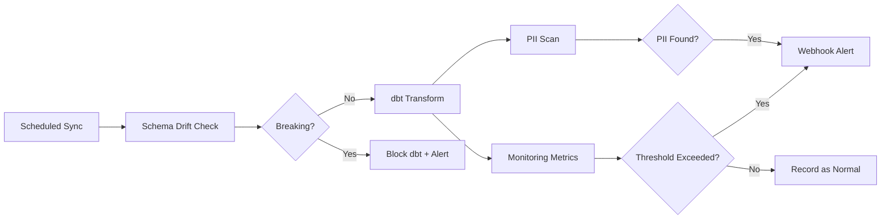

# Scheduling & Monitoring

Automate syncs, monitor data quality, detect schema changes, and scan for PII — all built in.

---

## Overview

Dango's scheduling and monitoring features cover three pillars:

**Scheduling** — Automate your data pipeline with cron-based schedules. Define when sources sync, when dbt runs, and get notified when things go wrong. Schedules persist across restarts and recover missed runs automatically.

**Monitoring** — Track key metrics after every sync and compare them against historical baselines. When a metric changes more than expected, Dango identifies which dimensions drove the change and sends an alert.

**Governance** — Protect data quality with automatic schema drift detection and PII scanning. Breaking schema changes block dbt to prevent silent failures. PII findings flag columns that may contain personal information.

## How It All Fits Together



After a scheduled sync completes, Dango runs a post-sync pipeline:

1. **Schema drift detection** compares the new schema against the baseline
2. **dbt transformation** runs (unless blocked by breaking drift)
3. **PII scanning** checks for personal information in newly synced data
4. **Monitoring metrics** evaluate configured monitors against historical baselines
5. **Webhook notifications** fire for any alerts or governance events

## Capabilities at a Glance

| Feature | What It Does | Guide |
|---------|-------------|-------|
| Scheduled Syncs | Cron-based automation for source syncs and dbt runs | [Scheduled Syncs](scheduled-syncs.md) |
| Webhook Notifications | Slack and HTTP alerts for sync events and governance findings | [Webhook Notifications](webhooks.md) |
| Monitoring Metrics | Automated metric tracking with baseline comparison | [Monitoring Metrics](metrics.md) |
| Configuring Monitors | Define metrics, thresholds, and drill-down dimensions | [Configuring Monitors](configuring.md) |
| Schema Drift | Detect breaking and additive schema changes | [Schema Drift](schema-drift.md) |
| PII Scanning | Find email addresses, phone numbers, and other PII in your data | [PII Scanning](pii-scanning.md) |
| Data Catalog | Browse models, columns, lineage, and profiling stats | [Data Catalog](data-catalog.md) |

## Section Guides

<div class="grid cards" markdown>

-   :material-clock-outline:{ .lg .middle } **Scheduled Syncs**

    ---

    Set up cron schedules to automate source syncs and dbt runs with retry, timeout, and missed-run recovery.

    [:octicons-arrow-right-24: Set up schedules](scheduled-syncs.md)

-   :material-bell-outline:{ .lg .middle } **Webhook Notifications**

    ---

    Get Slack or HTTP alerts when syncs complete, fail, go stale, or when governance events are detected.

    [:octicons-arrow-right-24: Configure webhooks](webhooks.md)

-   :material-chart-line:{ .lg .middle } **Monitoring Metrics**

    ---

    Understand how Dango compares metric values against baselines and detects trends.

    [:octicons-arrow-right-24: Learn about metrics](metrics.md)

-   :material-tune:{ .lg .middle } **Configuring Monitors**

    ---

    Define what to measure, set thresholds, and configure drill-down analysis in `monitors.yml`.

    [:octicons-arrow-right-24: Configure monitors](configuring.md)

-   :material-table-column:{ .lg .middle } **Schema Drift**

    ---

    Detect when source schemas change and protect dbt models from breaking silently.

    [:octicons-arrow-right-24: Understand schema drift](schema-drift.md)

-   :material-shield-search:{ .lg .middle } **PII Scanning**

    ---

    Automatically find personally identifiable information in your synced data.

    [:octicons-arrow-right-24: Scan for PII](pii-scanning.md)

-   :material-book-open-variant:{ .lg .middle } **Data Catalog**

    ---

    Browse models, columns, lineage graphs, and profiling statistics in one place.

    [:octicons-arrow-right-24: Explore the catalog](data-catalog.md)

</div>

## Quick Start

1. **Set up a schedule:**

    ```bash
    dango schedule add
    ```

2. **Add webhook notifications** (edit `.dango/schedules.yml`):

    ```yaml
    notifications:
      webhooks:
        - name: slack_alerts
          url: "https://hooks.slack.com/services/T.../B.../xxx"
          format: slack
      on_failure: true
      on_success: false
    ```

3. **Run monitors manually to see results:**

    ```bash
    dango monitor run
    ```

!!! tip "Cloud vs Local"
    Scheduling requires `dango start` running locally, or is always-on in cloud deployments. Cloud schedules run 24/7 via systemd and survive reboots automatically.

## What Runs When?

Understanding the order of operations helps you configure schedules and monitors effectively:

| Phase | What Happens | Configurable? |
|-------|-------------|---------------|
| 1. Source sync | dlt pulls data from configured sources into DuckDB | Schedule type: `sync` or `sync_only` |
| 2. Schema drift check | Compares new schema against saved baseline | Automatic — no config needed |
| 3. dbt transformation | Runs `dbt build` on your models | Schedule type: `sync` (included) or `dbt` (standalone) |
| 4. PII scan | Analyzes string columns for personal information | Automatic — runs after sync |
| 5. Monitoring | Evaluates configured monitors against baselines | Requires `monitors.yml` |
| 6. Notifications | Sends webhooks for any alerts | Requires webhooks in `schedules.yml` |

!!! note "Phases 2–6 are post-sync hooks"
    These run automatically after every sync (scheduled or manual). You don't need to configure them separately — they're part of the sync pipeline.

## Next Steps

- [Deployment](../deployment/index.md) — deploy to the cloud for 24/7 scheduling
- [CLI Schedule Commands](../cli/schedule-commands.md) — full CLI reference for schedule management
- [Local vs Cloud](../core-concepts/local-vs-cloud.md) — understand the differences between local and cloud operation
