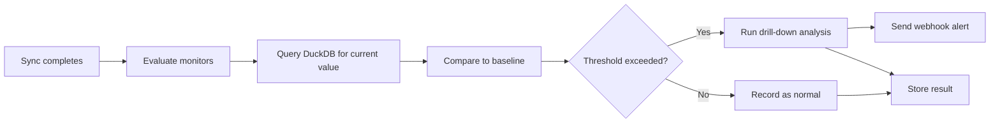

# Monitoring Metrics

Dango automatically tracks key metrics after every sync and compares them against historical baselines to detect unexpected changes — revenue drops, row count spikes, or gradual trends.

---

## Overview

After each sync completes, Dango evaluates your configured monitors: it queries DuckDB for the current metric value, compares it to a historical baseline, and flags results that exceed your alert threshold. If a metric is flagged, drill-down analysis identifies which dimensions (e.g., country, product) contributed most to the change.

Monitoring answers questions like:

- Did today's revenue drop more than 20% compared to last week?
- Is the row count for my `orders` table trending downward?
- Which customer segment drove the spike in refund amounts?

## How It Works



### Comparison Types

Dango supports 4 comparison strategies. Each compares the current metric value against a different baseline.

#### `week_over_week`

Compares today's value to the same metric recorded 7 days ago.

**Formula:** `change_pct = ((current - baseline) / |baseline|) * 100`

**Example:** Current revenue = $8,000. Last week's revenue = $10,000.
Change = ((8000 - 10000) / 10000) * 100 = **-20%**

**When to use:** Best for metrics with weekly seasonality (e.g., e-commerce revenue that peaks on weekends).

!!! tip "Best default choice"
    `week_over_week` is the default comparison type. It works well for most business metrics because it naturally accounts for weekly patterns — a Monday-to-Monday comparison avoids false alerts from weekend dips.

#### `rolling_7day_avg`

Compares today's value to the average of the last 7 recorded values.

**Formula:** Same percentage change formula, but baseline = mean of the last 7 values.

**Example:** Daily row counts for the past week: 1000, 1050, 980, 1020, 1100, 990, 1010. Average = 1021. Today's count = 750.
Change = ((750 - 1021) / 1021) * 100 = **-26.5%**

**When to use:** Smooths out daily noise. Good for metrics that fluctuate day-to-day but should stay within a range (e.g., daily active users, API call counts).

#### `rolling_30day_avg`

Same as `rolling_7day_avg` but uses the last 30 recorded values as baseline.

**Example:** If your daily revenue averages $5,000 over the past month but today drops to $2,500, that's a -50% change — clearly worth investigating even if yesterday was $4,800.

**When to use:** Best for detecting gradual shifts in metrics that are naturally volatile in the short term. Useful for financial metrics where you want a longer-term perspective.

#### `prior_period`

Compares today's value to the immediately previous recorded value (yesterday, or the last sync).

**Example:** Yesterday's row count was 10,000. Today it's 5,000. Change = **-50%**.

**When to use:** When you need to catch sudden changes regardless of historical context. Best for metrics that should be relatively stable between syncs (e.g., row counts in reference tables, system configuration counts).

### Comparison Type Summary

| Type | Baseline | Best For |
|------|----------|----------|
| `week_over_week` | Same day last week | Seasonal metrics (revenue, traffic) |
| `rolling_7day_avg` | Average of last 7 values | Noisy daily metrics |
| `rolling_30day_avg` | Average of last 30 values | Gradual trend detection |
| `prior_period` | Last recorded value | Sudden changes |

### Result Statuses

Each monitor evaluation produces one of these statuses:

| Status | Meaning |
|--------|---------|
| `flagged` | Change percentage exceeded the alert threshold |
| `trending` | Trend detection identified a consistent direction (increasing, decreasing, or stable) |
| `normal` | Value is within expected range |
| `error` | Query failed (SQL error, missing table, etc.) |

### Drill-Down Analysis

When a metric is **flagged** (threshold exceeded), Dango automatically runs a drill-down to identify which dimensions drove the change.

For each drill-down dimension you configure, Dango:

1. Groups the metric by that dimension (e.g., `country`, `product_category`)
2. Computes the metric value per group for the current and previous period
3. Ranks groups by absolute change
4. Returns the **top 3 contributors** to the overall change

**Limits:**

- Maximum **100 groups** per dimension (prevents runaway queries on high-cardinality columns)
- Top **3 contributors** returned per dimension
- Drill-down only runs when the threshold is exceeded — not on every evaluation

**Example:** Revenue dropped 25%. Drill-down on `country` shows:

| Country | Current | Previous | Change |
|---------|---------|----------|--------|
| Germany | $1,200 | $3,500 | -65.7% |
| France | $800 | $1,800 | -55.6% |
| UK | $2,000 | $2,500 | -20.0% |

### Trend Detection

Dango uses linear regression to detect trends over time, independent of the comparison type.

??? info "How trend detection works"
    Trend detection fits a line (ordinary least squares regression) through the most recent metric values:

    - **Minimum data points:** 14 (need at least 2 weeks of daily data)
    - **Maximum data points:** 30 (uses the most recent 30 values)
    - **Direction values:** `increasing`, `decreasing`, or `stable`
    - **Threshold:** Slope must exceed 1% of the mean value to be classified as increasing/decreasing
    - **Forecast:** If a threshold is configured, estimates how many days until the trend would cross it (capped at 365 days)

    Trend detection requires consistent data collection — if your syncs are irregular, trends may not be detected reliably.

### Running Monitors

Monitors run automatically after every scheduled sync. You can also run them manually:

=== "CLI"

    ```bash
    # Run all monitors
    dango monitor run

    # Run monitors for a specific source
    dango monitor run --source stripe

    # Alias: dango analyze (same command)
    dango analyze
    ```

    Example output:

    ```
    Monitoring Results
    ──────────────────
    Monitor                  Status    Current    Baseline   Change
    stripe_daily_revenue     normal    $8,450     $8,200     +3.0%
    stripe_new_customers     normal    142        138        +2.9%
    stripe_refund_rate       flagged   8.5%       4.2%       +102.4%
      ↳ Drill-down: currency
        USD    8.2% → 4.0%  (+105.0%)
        EUR    9.1% → 4.5%  (+102.2%)
    hubspot_contacts_count   normal    5,230      5,180      +1.0%
    ```

=== "Web UI"

    Navigate to the **Monitoring** page to see all monitor results in a table with:

    - Current and baseline values with change percentage
    - Trend indicators (increasing/decreasing/stable arrows)
    - dbt test results alongside metric results
    - Historical charts when you click a metric name

=== "API"

    ```
    GET  /api/monitoring              — Latest results for all monitors
    POST /api/monitoring/run          — Trigger a manual monitoring run
    GET  /api/monitoring/history?metric=stripe_daily_revenue&days=30
                                      — Historical values for a specific metric
    ```

### Storage and Retention

Monitor results are stored in two SQLite tables in `.dango/dango.db`:

| Table | Contents | Used For |
|-------|----------|----------|
| `metric_history` | One row per metric per evaluation (timestamp + value) | Baseline computation, trend detection |
| `metric_results` | Latest comparison result per metric (status, change %, baseline) | Web UI display, API responses |

History accumulates over time. There is no automatic pruning — historical data is kept for trend detection accuracy.

## Key Points

- **4 comparison types** are available: `week_over_week`, `rolling_7day_avg`, `rolling_30day_avg`, `prior_period`
- **Drill-down analysis only runs when a threshold is exceeded** — not on every evaluation
- **Trend detection requires at least 14 data points** — it won't produce results until you have ~2 weeks of history
- **Results are stored in SQLite** (`.dango/dango.db`) — the `metric_history` and `metric_results` tables
- **Monitors run automatically after sync** via the post-sync hook pipeline
- **`metric_alert` webhooks** fire when a monitor is flagged (see [Webhook Notifications](webhooks.md))

## Related

- [Configuring Monitors](configuring.md) — how to write monitor definitions and set thresholds
- [Webhook Notifications](webhooks.md) — `metric_alert` event type for threshold breaches
- [Scheduled Syncs](scheduled-syncs.md) — monitors run after scheduled syncs
