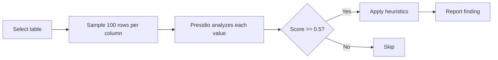

# PII Scanning

Automatically detect personally identifiable information in your synced data — email addresses, phone numbers, credit card numbers, and more.

---

!!! note "Prerequisites"
    - At least one data source synced
    - Presidio and spaCy are included in the `dango` package dependencies — no extra install needed

## Quick Start

1. **Run a PII scan:**

    ```bash
    dango governance pii-report
    ```

2. **Review findings** — each finding shows the source, table, column, entity type, and confidence.

3. **Mark false positives:**

    ```bash
    dango governance pii-set stripe charge customer_name not_pii --reason "Business name, not person"
    ```

## Detailed Steps

### How PII Scanning Works

PII scanning uses [Presidio](https://microsoft.github.io/presidio/) (Microsoft's data protection SDK) with [spaCy](https://spacy.io/) (an NLP library) to analyze text columns for patterns that look like personal information.



For each string column in your data, Dango:

1. Samples up to **100 distinct values** from the column
2. Runs each value through Presidio's NLP-based entity recognition
3. Filters results by a **confidence score threshold of 0.5**
4. Applies additional heuristics to reduce false positives
5. Reports findings with entity type, confidence, and match count

### Detected Entity Types

Dango scans for 7 types of PII:

| Entity Type | Examples | Notes |
|-------------|----------|-------|
| `EMAIL_ADDRESS` | `user@example.com` | High precision — very few false positives |
| `PHONE_NUMBER` | `+1-555-0123`, `(555) 867-5309` | May match formatted numbers |
| `CREDIT_CARD` | `4111-1111-1111-1111` | Luhn algorithm validation |
| `US_SSN` | `123-45-6789` | US Social Security Numbers |
| `IP_ADDRESS` | `192.168.1.1`, `2001:db8::1` | IPv4 and IPv6 |
| `IBAN_CODE` | `DE89 3704 0044 0532 0130 00` | International Bank Account Numbers |
| `PERSON` | `John Smith`, `Maria Garcia` | Uses spaCy NER — higher false positive rate (see below) |

!!! warning "PERSON entity has a higher false positive rate"
    The `PERSON` entity type uses spaCy's named entity recognition, which can flag product names, codes, or abbreviations as person names. Dango mitigates this with:

    - **30% match ratio threshold:** At least 30% of sampled values must match to flag a column
    - **Structured data heuristic:** Columns with long values (avg > 100 chars) containing JSON/array delimiters are excluded — these are typically structured data, not names

### Confidence Scoring

- **Threshold:** 0.5 (on a 0–1 scale). Results below this are discarded.
- **PERSON entity:** Requires at least 30% of sampled values to match (vs. any single match for other types). This dramatically reduces false positives from spaCy NER.
- **Structured data filter:** If a column's average value length exceeds 100 characters and values contain JSON/array delimiters (`[`, `]`, `{`, `\n`), the PERSON entity is suppressed for that column.

### Viewing Reports

=== "CLI"

    ```bash
    # Scan all sources
    dango governance pii-report

    # Scan a specific source
    dango governance pii-report --source stripe
    ```

    Example output:

    ```
    PII Scan Report
    ───────────────
    Source: stripe
    Table: customer

    Column          Entity          Confidence  Matches
    email           EMAIL_ADDRESS   0.95        98/100
    name            PERSON          0.72        45/100
    phone           PHONE_NUMBER    0.88        67/100

    Source: stripe
    Table: charge

    No PII detected.
    ```

=== "Web UI"

    Navigate to the **Catalog** page to see PII flags on individual columns, or the **Monitoring** page for a summary of PII findings.

=== "API"

    ```
    GET /api/governance/pii
    GET /api/governance/pii?source=stripe
    GET /api/governance/pii?source=stripe&table=customer
    ```

### Managing False Positives

If the scanner flags a column incorrectly, mark it as `not_pii`:

```bash
# Mark a column as not PII
dango governance pii-set stripe customer business_name not_pii \
  --reason "Contains company names, not person names"

# Mark a column as confirmed PII
dango governance pii-set stripe customer email pii \
  --reason "Customer email addresses"

# List all overrides
dango governance pii-list
```

Overrides are stored in `.dango/pii-overrides.yml`:

```yaml
# .dango/pii-overrides.yml (auto-managed by CLI)
overrides:
  - source: stripe
    table: customer
    column: business_name
    status: not_pii
    set_by: admin
    reason: "Contains company names, not person names"
    updated_at: "2026-05-15T10:30:00+00:00"
```

## Configuration Reference

### `pii-overrides.yml` Format

```yaml
overrides:
  - source: stripe            # Source name
    table: customer            # Table name within the source
    column: business_name      # Column name
    status: not_pii            # "pii" or "not_pii"
    set_by: admin              # Username who set the override
    reason: "Company names"    # Human-readable reason
    updated_at: "2026-05-15T10:30:00+00:00"
```

### Override Fields

| Field | Type | Description |
|-------|------|-------------|
| `source` | string | Source name (e.g., `stripe`) |
| `table` | string | Table name (e.g., `customer`) |
| `column` | string | Column name (e.g., `business_name`) |
| `status` | string | `pii` (confirmed PII) or `not_pii` (false positive) |
| `set_by` | string | Username of the person who created the override |
| `reason` | string | Explanation for the override |
| `updated_at` | datetime | When the override was last modified |

??? info "Presidio + spaCy internals"
    Dango uses Presidio's `AnalyzerEngine` with spaCy's `en_core_web_sm` language model for named entity recognition. The model is downloaded automatically the first time PII scanning runs.

    - **Engine initialization:** Lazy — Presidio and spaCy are loaded on first scan, not at startup
    - **Language model:** `en_core_web_sm` (English, small model) — balanced between accuracy and speed
    - **Scan scope:** Only string/text columns are scanned (VARCHAR, TEXT, STRING, CHAR, BPCHAR)
    - **Sample size:** 100 distinct values per column — balances coverage with performance
    - **Caching:** Scan results are cached in SQLite. Re-running a scan for the same source/table returns cached results unless new data has been synced.

## Verification

After running a PII scan, verify the results:

```bash
# Run a scan for a specific source
dango governance pii-report --source stripe

# Check that overrides are applied
dango governance pii-list
```

Verify that:

- High-confidence findings (>0.9) on columns like `email`, `phone` are correctly flagged
- Low-confidence findings on non-PII columns are marked as false positives
- Overrides correctly suppress known false positives in subsequent scans

## Troubleshooting

**Too many false positives**

- Use `dango governance pii-set` to mark false positives as `not_pii`
- The `PERSON` entity type is the most common source of false positives — it flags product names, codes, and abbreviations
- Columns with structured data (JSON, arrays) can trigger false PERSON matches — the structured data heuristic should catch most of these

**PERSON entity noise**

- The 30% match ratio threshold filters out columns where only a few values look like names
- If a column consistently produces false PERSON matches, mark it with `pii-set ... not_pii`
- Consider whether the column actually contains person names embedded in other text

**spaCy model not found**

- The `en_core_web_sm` model is downloaded automatically on first use
- If download fails (e.g., no internet), run manually: `python -m spacy download en_core_web_sm`
- Verify installation: `python -c "import spacy; spacy.load('en_core_web_sm')"`

**Scan taking too long**

- PII scanning samples 100 values per column — it shouldn't take more than a few seconds per table
- If a source has many tables with many string columns, scans can take longer
- Use `--source` to scan a specific source instead of all sources at once

## Next Steps

- [Schema Drift](schema-drift.md) — another governance feature that protects data quality
- [Webhook Notifications](webhooks.md) — `pii_detected` event type for automated alerts
- [Data Catalog](data-catalog.md) — PII flags are visible in the catalog's column metadata
