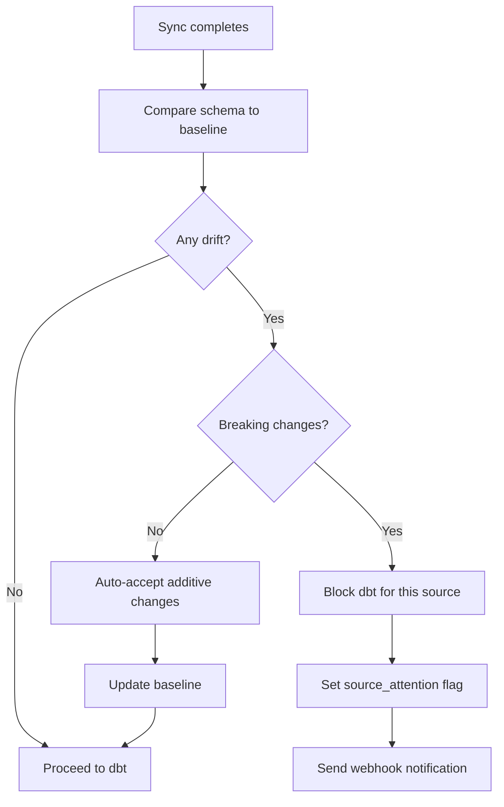

# Schema Drift

Dango automatically detects when your data sources change their schema — new columns, removed columns, or type changes — and protects your dbt models from breaking silently.

---

## Overview

Schema drift happens when an upstream data source changes its structure. A SaaS API adds a field, a database column gets renamed, or a CSV column type changes. Without detection, these changes can silently break dbt models, produce incorrect dashboards, or cause sync failures.

Dango's schema drift detection runs **automatically after every sync, before dbt**. It compares the freshly synced schema against a saved baseline and classifies changes as **breaking** or **additive**.

## How It Works

### Drift Event Types

| Event Type | Severity | Example | Impact |
|------------|----------|---------|--------|
| `column_removed` | **Breaking** | `email` column no longer exists | dbt models referencing this column will fail |
| `type_changed` | **Breaking** | `amount` changed from `INTEGER` to `VARCHAR` | SQL aggregations may produce wrong results |
| `column_added` | Additive | New `phone_number` column appeared | No impact — existing models still work |

### Detection Flow



### What Happens on Breaking Drift

When breaking drift is detected (`column_removed` or `type_changed`):

1. **dbt is skipped** for the affected source — other sources still run normally
2. **Source attention flag** is set — the Web UI shows a "Needs Attention" banner
3. **Webhook notification** fires (`schema_drift_detected` event, if configured)
4. **Drift report** is stored for review

!!! danger "Breaking Drift Blocks dbt"
    Until you accept the drift, dbt models will **not** run for the affected source. This prevents broken models from producing incorrect data in your dashboards.

### What Happens on Additive Drift

When only additive changes are detected (`column_added`):

1. **Logged** in the drift history for auditability
2. **Baseline auto-updated** — the new column is added to the saved schema snapshot
3. **dbt proceeds normally** — no action required from you

Additive changes are safe because existing dbt models don't reference the new columns. Your models continue to work exactly as before — the new column is simply available for future use.

!!! tip "Additive drift is a feature opportunity"
    When you see `column_added` events, consider whether the new column is useful. You might want to add it to your staging models or create a new metric monitor for it.

### The Accept Flow

When you see breaking drift, review the changes and decide whether to accept:

**Step 1: View the drift report**

=== "CLI"

    ```bash
    dango governance drift-report

    # Filter by source
    dango governance drift-report --source stripe
    ```

    Example output:

    ```
    Schema Drift Report
    ───────────────────
    Source: stripe
    Table: charge

    ⚠ BREAKING CHANGES
      column_removed: email        (was VARCHAR)
      type_changed:   amount       INTEGER → VARCHAR

    ✓ ADDITIVE CHANGES
      column_added:   phone_number (type=VARCHAR)
    ```

=== "Web UI"

    Navigate to the **Sources** page. Sources with drift show a "Needs Attention" banner. Click to view the drift report.

=== "API"

    ```
    GET /api/governance/schema-drift?source=stripe
    ```

**Step 2: Review the impact**

- Check which dbt models reference the changed columns
- Verify whether the change is expected (e.g., the SaaS provider announced a schema update)
- Update your dbt models if needed

**Step 3: Accept the drift**

=== "CLI"

    ```bash
    dango governance accept stripe
    ```

=== "API"

    ```
    POST /api/governance/drift/{source}/accept
    ```

After accepting:

- The current schema becomes the new baseline
- The source attention flag is cleared
- dbt runs normally on the next sync

??? info "How baselines work"
    Schema baselines are stored in SQLite (`.dango/dango.db`). Each source+table combination has a JSON snapshot of column names and types.

    - **First sync:** The initial schema is saved as the baseline automatically
    - **Additive drift:** Baseline is updated automatically (new columns are added)
    - **Breaking drift:** Baseline is only updated when you explicitly accept
    - **After accept:** The current DuckDB schema is re-read and saved as the new baseline

??? info "API endpoints"

    | Method | Path | Description |
    |--------|------|-------------|
    | `GET` | `/api/governance/schema-drift` | List drift events (optional `?source=` and `?table=` filters) |
    | `POST` | `/api/governance/drift/{source}/accept` | Accept drift and update baseline |
    | `GET` | `/api/governance/attention` | List sources with active attention flags |

### Web UI

The Web UI surfaces drift information in several places:

- **Sources page:** Sources with unresolved breaking drift show a "Needs Attention" banner with a red indicator
- **Source detail modal:** Click a source to see its drift report, including all detected events with timestamps
- **Accept button:** Accept drift directly from the Web UI without using the CLI

### Common Drift Scenarios

**SaaS provider adds a field**

A SaaS API (e.g., Stripe) adds a new field to their response. This shows up as `column_added` — additive drift. No action needed. Your existing models keep working, and the new column is available in `raw_*` tables for future use.

**SaaS provider removes a deprecated field**

A field you reference in your dbt models gets removed. This shows up as `column_removed` — breaking drift. dbt is blocked until you:

1. Update your dbt models to remove references to the deleted column
2. Accept the drift via `dango governance accept <source>`

**CSV column type changes**

You upload a CSV where a column that was previously all integers now contains text. This shows up as `type_changed` (e.g., `INTEGER → VARCHAR`). Review your models to ensure they handle the new type, then accept.

**First sync after adding a source**

The first sync establishes the baseline — no drift is detected. All subsequent syncs compare against this baseline.

## Key Points

- **Runs before dbt** — drift detection happens after sync but before transformation, preventing broken models
- **Breaking drift blocks dbt** — `column_removed` and `type_changed` require explicit acceptance
- **Additive drift is auto-accepted** — `column_added` updates the baseline without intervention
- **Must accept to unblock** — until you accept, dbt will skip models for the affected source
- **Baselines are per-source per-table** — each table has its own schema snapshot
- **First sync establishes the baseline** — no false positives on initial data load
- **Multiple sources are independent** — drift in one source doesn't affect dbt for other sources

## Related

- [Webhook Notifications](webhooks.md) — `schema_drift_detected` event type
- [PII Scanning](pii-scanning.md) — another governance feature that runs after sync
- [Scheduled Syncs](scheduled-syncs.md) — drift detection runs as part of the sync pipeline
