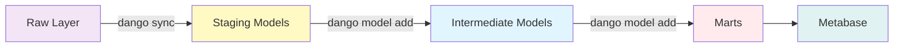
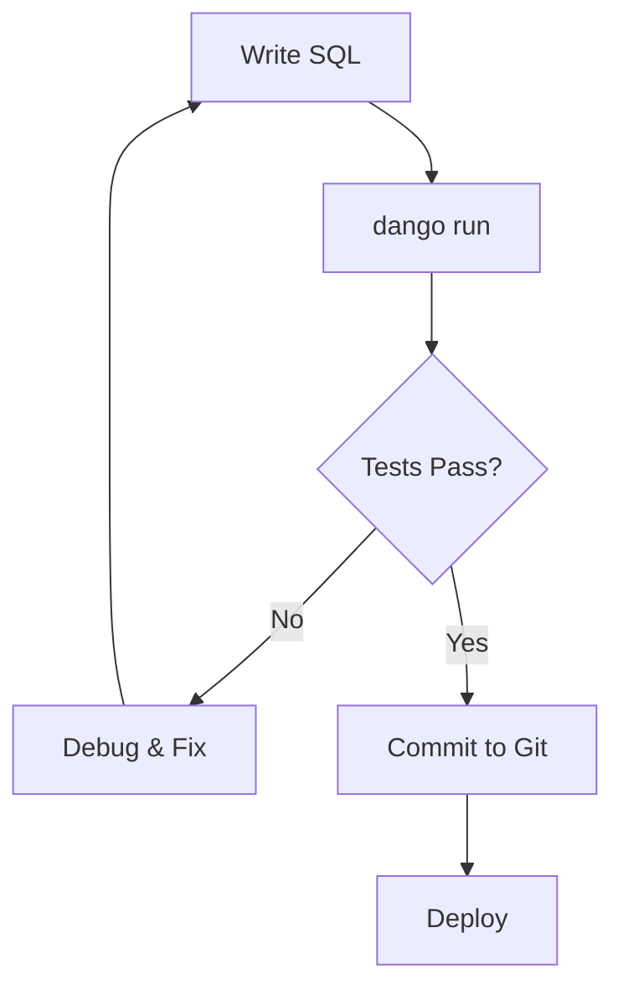

# Transformations

Transform raw data into analytics-ready tables with dbt and DuckDB.

---

## Overview

Transformations in Dango use **dbt (data build tool)** to convert raw ingested data into clean, modeled tables for analytics. Dango combines the power of dbt with DuckDB to give you:

- **Auto-generated staging model templates** from raw tables
- **Interactive model creation** via `dango model add`
- **Custom SQL transformations** for business logic
- **Auto-generated data quality tests** (unique, not_null)
- **dbt documentation** viewable via Web UI

**Tech Stack**:

- **dbt 1.7+** - SQL transformation framework
- **DuckDB 0.10+** - Embedded analytics database
- **Jinja** - SQL templating for dynamic logic

---

## Data Flow

Understanding how data transforms through layers:



### Transformation Layers

| Layer | Purpose | Created By | Materialization |
|-------|---------|------------|-----------------|
| **Raw** | Source of truth from dlt | `dango sync` | Tables |
| **Staging** | Template for cleaning data | `dango sync` (auto) | Tables |
| **Intermediate** | Reusable business logic | `dango model add` | Tables |
| **Marts** | Final analytics tables | `dango model add` | Tables |

!!! note "Why Tables?"
    All models are materialized as tables (not views) for Metabase compatibility.

---

## Quick Start

### End-to-End Example

```bash
# 1. Load raw data (also generates staging model templates)
dango sync --source stripe_payments

# 2. Create a custom mart using the wizard
dango model add
# Select "marts", enter "customer_metrics", add description

# 3. Edit the generated model file
# Open dbt/models/marts/customer_metrics.sql in your editor
# Replace the template with your SQL logic

# 4. Run transformations
dango run

# 5. View results in Metabase
dango start
# Open http://localhost:8800 → Metabase
```

### Example Mart SQL

After creating a model with `dango model add`, edit the file:

```sql
-- dbt/models/marts/customer_metrics.sql
{{ config(materialized='table') }}

WITH customer_orders AS (
    SELECT
        customer,
        COUNT(*) as order_count,
        SUM(amount / 100.0) as total_spent
    FROM {{ ref('stg_stripe_charges') }}
    WHERE status = 'succeeded'
    GROUP BY customer
)

SELECT
    c.id as customer_id,
    c.email,
    COALESCE(o.order_count, 0) as lifetime_orders,
    COALESCE(o.total_spent, 0) as lifetime_value
FROM {{ ref('stg_stripe_customers') }} c
LEFT JOIN customer_orders o ON c.id = o.customer
```

---

## Transformation Guides

<div class="grid cards" markdown>

-   :material-auto-fix: **dbt Basics**

    ---

    Learn dbt fundamentals and how it integrates with Dango.

    - dbt project structure
    - Materializations (view, table, incremental)
    - Jinja templating and macros
    - Running and debugging models

    [:octicons-arrow-right-24: dbt Basics Guide](dbt-basics.md)

-   :material-table-sync: **Staging Models**

    ---

    Deep dive into Dango's auto-generated staging model templates.

    - How staging templates are generated
    - Customizing staging models
    - Column naming conventions
    - When to regenerate

    [:octicons-arrow-right-24: Staging Models Guide](staging-models.md)

-   :material-cube-outline: **Custom Models**

    ---

    Build intermediate layers and data marts for analytics.

    - Intermediate vs. marts models
    - Common SQL patterns (cohorts, funnels, time series)
    - Advanced techniques (macros, incremental)
    - Performance optimization

    [:octicons-arrow-right-24: Custom Models Guide](custom-models.md)

-   :material-test-tube: **Testing**

    ---

    Comprehensive data quality testing with dbt.

    - Schema tests (unique, not_null, relationships)
    - Custom SQL tests
    - dbt_utils test library
    - Testing best practices

    [:octicons-arrow-right-24: Testing Guide](testing.md)

</div>

---

## Key Concepts

### Auto-Generated Staging

When you run `dango sync`, staging model templates are automatically generated:

```bash
dango sync --source stripe_payments
# Creates raw data AND staging templates
```

**Creates**:

```
dbt/models/staging/
├── stg_stripe_charges.sql          # Staging template
├── stg_stripe_customers.sql        # Staging template
├── stg_stripe_subscriptions.sql    # Staging template
├── _stg_stripe__sources.yml        # Source references
└── _stg_stripe__schema.yml         # Tests & documentation
```

**Generated SQL** (template):

```sql
-- stg_stripe_charges.sql
{{ config(materialized='table', schema='staging') }}

SELECT * FROM {{ source('stripe', 'charges') }}
```

!!! note "Template Design"
    Staging templates are intentionally minimal (`SELECT *`). You customize them by adding:

    - Column selection
    - Type casting
    - Deduplication logic (if needed)

    See the [Staging Models Guide](staging-models.md) for customization patterns.

### Custom Business Logic

You write intermediate and marts models:

```sql
-- dbt/models/marts/revenue_by_month.sql
{{ config(materialized='table') }}

SELECT
    DATE_TRUNC('month', created) as month,
    COUNT(*) as transactions,
    SUM(amount / 100.0) as revenue_usd
FROM {{ ref('stg_stripe_charges') }}
WHERE status = 'succeeded'
GROUP BY month
ORDER BY month DESC
```

### Data Testing

Add tests in schema YAML:

```yaml
# dbt/models/marts/schema.yml
models:
  - name: revenue_by_month
    columns:
      - name: month
        tests:
          - unique
          - not_null

      - name: revenue_usd
        tests:
          - not_null
          - dbt_utils.expression_is_true:
              expression: ">= 0"
```

---

## Common Workflows

### Development Workflow



**Commands**:

```bash
# 1. Edit model
vim dbt/models/marts/customer_metrics.sql

# 2. Run model
dango run --select customer_metrics

# 3. Test model
dbt test --profiles-dir dbt --project-dir dbt --select customer_metrics

# 4. View in Metabase (via dango start)
# Open http://localhost:8800
```

### Adding a New Mart

**Option 1: Using the wizard (recommended)**

```bash
# 1. Create model via wizard
dango model add
# Select "marts", enter "monthly_mrr", add description

# 2. Edit the generated template
vim dbt/models/marts/monthly_mrr.sql
# Replace SELECT * with your SQL logic

# 3. Run and test
dango run --select monthly_mrr
dbt test --profiles-dir dbt --project-dir dbt --select monthly_mrr
```

**Option 2: Manual creation**

```bash
# 1. Create SQL file
cat > dbt/models/marts/monthly_mrr.sql << 'EOF'
{{ config(materialized='table') }}

SELECT
    DATE_TRUNC('month', created) as month,
    SUM(amount / 100.0) as mrr
FROM {{ ref('stg_stripe_subscriptions') }}
WHERE status = 'active'
GROUP BY month
EOF

# 2. Run and test
dango run --select monthly_mrr
dbt test --profiles-dir dbt --project-dir dbt --select monthly_mrr
```

!!! tip "Schema files"
    `dango model add` auto-generates basic tests in schema.yml. For manual creation,
    add your own schema.yml file with documentation and tests.

### Schema Changes

When source data changes:

```bash
# 1. Sync new data (auto-regenerates staging templates)
dango sync --source stripe_payments

# 2. Update downstream models if needed
vim dbt/models/marts/customer_metrics.sql

# 3. Run transformations
dango run
```

!!! note "Automatic regeneration"
    `dango sync` automatically regenerates staging model templates when source schemas change.
    You only need to run `dango generate` manually if you want to regenerate without syncing data.

---

## Project Structure

### Standard dbt Layout

```
dbt/
├── dbt_project.yml              # Project configuration
├── profiles.yml                 # DuckDB connection (auto-configured)
├── packages.yml                 # dbt package dependencies
├── models/
│   ├── staging/                 # Auto-generated (dango sync)
│   │   ├── stg_*.sql
│   │   ├── _stg_*__sources.yml
│   │   └── _stg_*__schema.yml
│   ├── intermediate/            # Your reusable logic (dango model add)
│   │   ├── int_customer_orders.sql
│   │   └── schema.yml
│   └── marts/                   # Your final analytics tables (dango model add)
│       ├── finance/
│       │   ├── revenue_by_month.sql
│       │   ├── mrr_analysis.sql
│       │   └── schema.yml
│       ├── marketing/
│       │   ├── customer_acquisition.sql
│       │   └── schema.yml
│       └── operations/
│           └── fulfillment_metrics.sql
├── tests/                       # Custom SQL tests
│   ├── assert_revenue_reconciliation.sql
│   └── assert_no_duplicates.sql
├── macros/                      # Reusable SQL snippets
│   └── currency_conversion.sql
└── snapshots/                   # Slowly changing dimensions
    └── customer_snapshot.sql
```

### Schema Organization in DuckDB

```sql
-- View schemas
duckdb data/warehouse.duckdb "SHOW SCHEMAS;"

-- Output:
raw_stripe       -- Raw data from dlt (source-specific, e.g., raw_stripe, raw_hubspot)
staging          -- Auto-generated staging models (stg_* tables)
intermediate     -- Your intermediate models (int_* tables)
marts            -- Your marts models
```

!!! note "Schema naming"
    Raw schemas are prefixed with `raw_` followed by the source name (e.g., `raw_stripe`, `raw_hubspot`).
    This keeps data from different sources isolated.

---

## dbt Commands Reference

### Via Dango (Recommended)

```bash
# Run all transformations
dango run

# Run specific model
dango run --select customer_metrics

# Create a new model (intermediate or marts)
dango model add

# Remove a model
dango model remove customer_metrics

# Regenerate staging templates (usually not needed - sync does this)
dango generate
```

!!! tip "Viewing documentation"
    dbt docs are available at `http://localhost:8800/dbt-docs` when `dango start` is running.

### Via dbt Directly

```bash
# Run all models
dbt run --profiles-dir dbt --project-dir dbt

# Run specific model
dbt run --profiles-dir dbt --project-dir dbt --select customer_metrics

# Test all models
dbt test --profiles-dir dbt --project-dir dbt

# Generate and serve docs
dbt docs generate --profiles-dir dbt --project-dir dbt
dbt docs serve --profiles-dir dbt --project-dir dbt --port 8081
```

### Selective Execution

```bash
# Run one model (via dbt directly)
dbt run --profiles-dir dbt --project-dir dbt --select customer_metrics

# Run model and downstream dependencies
dbt run --profiles-dir dbt --project-dir dbt --select customer_metrics+

# Run model and upstream dependencies
dbt run --profiles-dir dbt --project-dir dbt --select +customer_metrics

# Run all marts
dbt run --profiles-dir dbt --project-dir dbt --select marts.*

# Run by tag
dbt run --profiles-dir dbt --project-dir dbt --select tag:finance
```

---

## Best Practices

### 1. Keep Staging Simple

Staging models should only:

- Select columns
- Rename columns
- Cast data types
- Deduplicate

**Don't** add business logic in staging.

### 2. Layer Your Transformations

```
Raw → Staging → Intermediate → Marts
 ↓       ↓           ↓            ↓
sync   sync      model add    model add
       (auto)
```

### 3. Use CTEs for Readability

```sql
-- Good
WITH base AS (...),
     filtered AS (...),
     aggregated AS (...)
SELECT * FROM aggregated

-- Avoid
SELECT ... FROM (...) JOIN (...) WHERE ...
```

### 4. Document Everything

```yaml
models:
  - name: customer_metrics
    description: |
      Customer lifetime value and engagement metrics.
      Updated daily via dango sync && dango run.
    columns:
      - name: customer_id
        description: Stripe customer ID (primary key)
```

### 5. Test Critical Assumptions

```yaml
tests:
  - unique
  - not_null
  - relationships:
      to: ref('dim_customers')
      field: customer_id
  - dbt_utils.expression_is_true:
      expression: "lifetime_value >= 0"
```

### 6. Version Control Everything

```bash
git add dbt/models/
git commit -m "Add customer metrics mart"
```

---

## Performance Tips

### Materialization in Dango

All Dango models use **table** materialization by default for Metabase compatibility.

!!! info "Why tables?"
    Metabase requires tables for reliable schema discovery. Views can work but may have
    inconsistent behavior with some Metabase features.

For large datasets with frequent updates, consider incremental materialization:

| Use Case | Materialization | Why |
|----------|-----------------|-----|
| Most models | `table` | Metabase compatibility, fast queries |
| Large event tables | `incremental` | Efficient updates |

### Optimize Complex Queries

```sql
-- Bad: Multiple scans
SELECT
    customer_id,
    (SELECT COUNT(*) FROM orders WHERE customer_id = c.id),
    (SELECT SUM(amount) FROM orders WHERE customer_id = c.id)
FROM customers c

-- Good: Single scan
WITH order_stats AS (
    SELECT customer_id, COUNT(*) as cnt, SUM(amount) as total
    FROM orders GROUP BY customer_id
)
SELECT c.customer_id, o.cnt, o.total
FROM customers c
LEFT JOIN order_stats o ON c.id = o.customer_id
```

### Use Incremental for Scale

```sql
{{ config(
    materialized='incremental',
    unique_key='event_id'
) }}

SELECT * FROM {{ ref('stg_events') }}

WHERE event_timestamp > (SELECT MAX(event_timestamp) FROM {{ this }})

```

---

## Troubleshooting

### Model Fails to Run

**Check dependencies**:

```bash
dbt compile --profiles-dir dbt --project-dir dbt --select customer_metrics
```

**View compiled SQL**:

```bash
cat dbt/target/compiled/dango/models/marts/customer_metrics.sql
```

### Staging Models Out of Date

If staging templates don't reflect source schema changes:

```bash
# Option 1: Re-sync (recommended - also updates data)
dango sync --source stripe_payments

# Option 2: Regenerate templates only
dango generate
```

### Tests Failing

**Run with debug**:

```bash
dbt test --profiles-dir dbt --project-dir dbt --select customer_metrics --debug
```

**Check failed rows**:

```bash
dbt test --profiles-dir dbt --project-dir dbt --store-failures
duckdb data/warehouse.duckdb "SELECT * FROM dbt_test__audit.unique_customer_metrics_customer_id"
```

---

## Example: Complete Transformation

### 1. Source Configuration

```yaml
# .dango/sources.yml
sources:
  - name: stripe_payments
    type: stripe
    enabled: true
    stripe:
      stripe_secret_key_env: STRIPE_API_KEY
      start_date: 2024-01-01
```

### 2. Load Raw Data

```bash
dango sync --source stripe_payments
```

**Creates**:

- `raw_stripe.charges`
- `raw_stripe.customers`
- `raw_stripe.subscriptions`

### 3. Staging Templates (Auto-Generated)

`dango sync` automatically creates staging templates:

- `dbt/models/staging/stg_stripe_charges.sql`
- `dbt/models/staging/stg_stripe_customers.sql`
- Schema YAML files with basic tests

### 4. Create Custom Mart

```sql
-- dbt/models/marts/customer_lifetime_value.sql
{{ config(materialized='table') }}

WITH customer_orders AS (
    SELECT
        customer,
        COUNT(*) as order_count,
        SUM(amount / 100.0) as total_spent,
        MIN(created) as first_order,
        MAX(created) as last_order
    FROM {{ ref('stg_stripe_charges') }}
    WHERE status = 'succeeded'
    GROUP BY customer
),

customers AS (
    SELECT id, email, created
    FROM {{ ref('stg_stripe_customers') }}
)

SELECT
    c.id as customer_id,
    c.email,
    c.created as customer_since,
    COALESCE(o.order_count, 0) as lifetime_orders,
    COALESCE(o.total_spent, 0) as lifetime_value,
    o.first_order,
    o.last_order
FROM customers c
LEFT JOIN customer_orders o ON c.id = o.customer
```

### 5. Add Tests

```yaml
# dbt/models/marts/schema.yml
version: 2
models:
  - name: customer_lifetime_value
    description: Customer LTV metrics
    columns:
      - name: customer_id
        tests: [unique, not_null]
      - name: lifetime_value
        tests:
          - not_null
          - dbt_utils.expression_is_true:
              expression: ">= 0"
```

### 6. Run and Test

```bash
dango run
dbt test --profiles-dir dbt --project-dir dbt
```

### 7. Query Results

```sql
-- In Metabase or DuckDB
SELECT * FROM marts.customer_lifetime_value
ORDER BY lifetime_value DESC
LIMIT 10;
```

---

## Next Steps

<div class="grid cards" markdown>

-   :material-transit-connection-variant: **Core Concepts**

    ---

    Understand Dango's data architecture and layering strategy.

    [:octicons-arrow-right-24: Core Concepts](../core-concepts/index.md)

-   :material-database-outline: **Data Sources**

    ---

    Learn how to ingest data from APIs, databases, and files.

    [:octicons-arrow-right-24: Data Sources](../data-sources/index.md)

-   :material-chart-line: **Dashboards**

    ---

    Visualize your transformed data in Metabase.

    [:octicons-arrow-right-24: Dashboards](../dashboards/index.md)

-   :material-book-open-outline: **dbt Documentation**

    ---

    Explore official dbt resources and advanced features.

    [:octicons-arrow-right-24: dbt Docs](https://docs.getdbt.com/)

</div>
