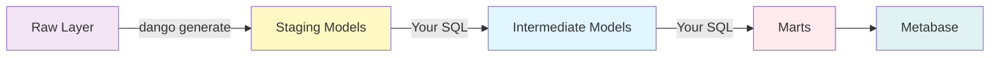
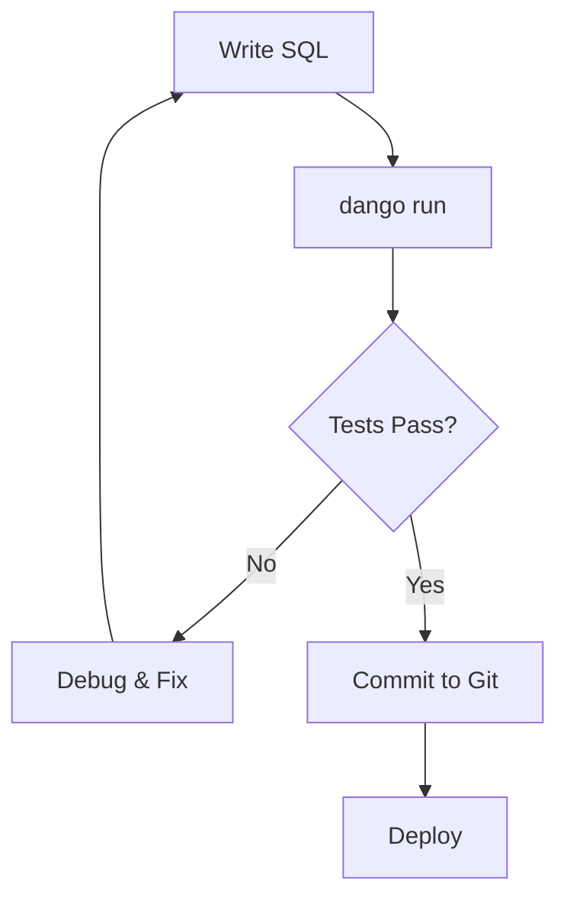

# Transformations

Transform raw data into analytics-ready tables with dbt and DuckDB.

---

## Overview

Transformations in Dango use **dbt (data build tool)** to convert raw ingested data into clean, modeled tables for analytics. Dango combines the power of dbt with DuckDB to give you:

- **Auto-generated staging models** from raw tables
- **Custom SQL transformations** for business logic
- **Data quality testing** built into your workflow
- **Automatic documentation** with lineage graphs
- **Version control** for all transformations

**Tech Stack**:

- **dbt 1.7+** - SQL transformation framework
- **DuckDB 0.10+** - Embedded analytics database
- **Jinja** - SQL templating for dynamic logic

---

## Data Flow

Understanding how data transforms through layers:



### Transformation Layers

| Layer | Purpose | Created By | Materialization |
|-------|---------|------------|-----------------|
| **Raw** | Source of truth from dlt | `dango sync` | Tables |
| **Staging** | Clean, deduplicated data | `dango generate` | Views |
| **Intermediate** | Reusable business logic | You (SQL) | Views |
| **Marts** | Final analytics tables | You (SQL) | Tables |

---

## Quick Start

### End-to-End Example

```bash
# 1. Load raw data
dango sync --source stripe_payments

# 2. Generate staging models
dango generate

# 3. Create custom mart
cat > dbt/models/marts/customer_metrics.sql << 'EOF'
{{ config(materialized='table') }}

WITH customer_orders AS (
    SELECT
        customer,
        COUNT(*) as order_count,
        SUM(amount / 100.0) as total_spent
    FROM {{ ref('stg_stripe_charges') }}
    WHERE status = 'succeeded'
    GROUP BY customer
)

SELECT
    c.id as customer_id,
    c.email,
    COALESCE(o.order_count, 0) as lifetime_orders,
    COALESCE(o.total_spent, 0) as lifetime_value
FROM {{ ref('stg_stripe_customers') }} c
LEFT JOIN customer_orders o ON c.id = o.customer
EOF

# 4. Run transformations
dango run

# 5. Test data quality
dbt test --profiles-dir .dango --project-dir dbt

# 6. View documentation
dango docs
```

---

## Transformation Guides

<div class="grid cards" markdown>

-   :material-auto-fix: **dbt Basics**

    ---

    Learn dbt fundamentals and how it integrates with Dango.

    - dbt project structure
    - Materializations (view, table, incremental)
    - Jinja templating and macros
    - Running and debugging models

    [:octicons-arrow-right-24: dbt Basics Guide](dbt-basics.md)

-   :material-table-sync: **Staging Models**

    ---

    Deep dive into Dango's auto-generated staging models.

    - How `dango generate` works
    - Deduplication strategies
    - Column naming conventions
    - Regeneration workflow

    [:octicons-arrow-right-24: Staging Models Guide](staging-models.md)

-   :material-cube-outline: **Custom Models**

    ---

    Build intermediate layers and data marts for analytics.

    - Intermediate vs. marts models
    - Common SQL patterns (cohorts, funnels, time series)
    - Advanced techniques (macros, incremental)
    - Performance optimization

    [:octicons-arrow-right-24: Custom Models Guide](custom-models.md)

-   :material-test-tube: **Testing**

    ---

    Comprehensive data quality testing with dbt.

    - Schema tests (unique, not_null, relationships)
    - Custom SQL tests
    - dbt_utils test library
    - Testing best practices

    [:octicons-arrow-right-24: Testing Guide](testing.md)

</div>

---

## Key Concepts

### Auto-Generated Staging

Dango automatically generates staging models from raw tables:

```bash
dango generate
```

**Creates**:

```
dbt/models/staging/
├── stg_stripe_charges.sql          # Deduped charges
├── stg_stripe_customers.sql        # Deduped customers
├── stg_stripe_subscriptions.sql    # Deduped subscriptions
├── _stg_stripe__sources.yml        # Source references
└── _stg_stripe__schema.yml         # Tests & documentation
```

**Generated SQL** (example):

```sql
-- stg_stripe_charges.sql
{{ config(materialized='view') }}

WITH deduplicated AS (
    SELECT *,
        ROW_NUMBER() OVER (
            PARTITION BY id
            ORDER BY _dlt_extracted_at DESC
        ) as _rn
    FROM {{ source('stripe', 'charges') }}
)

SELECT
    id,
    customer,
    amount,
    currency,
    status,
    created,
    _dlt_load_id,
    _dlt_extracted_at
FROM deduplicated
WHERE _rn = 1
```

### Custom Business Logic

You write intermediate and marts models:

```sql
-- dbt/models/marts/revenue_by_month.sql
{{ config(materialized='table') }}

SELECT
    DATE_TRUNC('month', created) as month,
    COUNT(*) as transactions,
    SUM(amount / 100.0) as revenue_usd
FROM {{ ref('stg_stripe_charges') }}
WHERE status = 'succeeded'
GROUP BY month
ORDER BY month DESC
```

### Data Testing

Add tests in schema YAML:

```yaml
# dbt/models/marts/schema.yml
models:
  - name: revenue_by_month
    columns:
      - name: month
        tests:
          - unique
          - not_null

      - name: revenue_usd
        tests:
          - not_null
          - dbt_utils.expression_is_true:
              expression: ">= 0"
```

---

## Common Workflows

### Development Workflow



**Commands**:

```bash
# 1. Edit model
vim dbt/models/marts/customer_metrics.sql

# 2. Run model
dango run --select customer_metrics

# 3. Test model
dbt test --profiles-dir .dango --project-dir dbt --select customer_metrics

# 4. View in Metabase
# Open http://localhost:3000
```

### Adding a New Mart

```bash
# 1. Create SQL file
cat > dbt/models/marts/finance/monthly_mrr.sql << 'EOF'
{{ config(materialized='table') }}

SELECT
    DATE_TRUNC('month', created) as month,
    SUM(amount / 100.0) as mrr
FROM {{ ref('stg_stripe_subscriptions') }}
WHERE status = 'active'
GROUP BY month
EOF

# 2. Add documentation
cat > dbt/models/marts/finance/schema.yml << 'EOF'
version: 2
models:
  - name: monthly_mrr
    description: Monthly recurring revenue from active subscriptions
    columns:
      - name: month
        tests: [unique, not_null]
      - name: mrr
        tests: [not_null]
EOF

# 3. Run and test
dango run --select monthly_mrr
dbt test --profiles-dir .dango --project-dir dbt --select monthly_mrr
```

### Schema Changes

When source data changes:

```bash
# 1. Sync new data
dango sync --source stripe_payments

# 2. Regenerate staging (picks up new columns)
dango generate --source stripe_payments

# 3. Update downstream models if needed
vim dbt/models/marts/customer_metrics.sql

# 4. Run transformations
dango run
```

---

## Project Structure

### Standard dbt Layout

```
dbt/
├── dbt_project.yml              # Project configuration
├── profiles.yml                 # DuckDB connection (auto-configured)
├── packages.yml                 # dbt package dependencies
├── models/
│   ├── staging/                 # Auto-generated (dango generate)
│   │   ├── stg_*.sql
│   │   ├── _stg_*__sources.yml
│   │   └── _stg_*__schema.yml
│   ├── intermediate/            # Your reusable logic
│   │   ├── int_customer_orders.sql
│   │   └── schema.yml
│   └── marts/                   # Your final analytics tables
│       ├── finance/
│       │   ├── revenue_by_month.sql
│       │   ├── mrr_analysis.sql
│       │   └── schema.yml
│       ├── marketing/
│       │   ├── customer_acquisition.sql
│       │   └── schema.yml
│       └── operations/
│           └── fulfillment_metrics.sql
├── tests/                       # Custom SQL tests
│   ├── assert_revenue_reconciliation.sql
│   └── assert_no_duplicates.sql
├── macros/                      # Reusable SQL snippets
│   └── currency_conversion.sql
└── snapshots/                   # Slowly changing dimensions
    └── customer_snapshot.sql
```

### Schema Organization in DuckDB

```sql
-- View schemas
duckdb data/warehouse.duckdb "SHOW SCHEMAS;"

-- Output:
raw              -- dlt ingested data
raw_stripe       -- Multi-table sources
staging          -- Auto-generated staging
intermediate     -- Your intermediate models
marts            -- Your marts models
```

---

## dbt Commands Reference

### Via Dango (Recommended)

```bash
# Run all transformations
dango run

# Generate staging models
dango generate

# View documentation
dango docs
```

### Via dbt Directly

```bash
# Run all models
dbt run --profiles-dir .dango --project-dir dbt

# Run specific model
dbt run --profiles-dir .dango --project-dir dbt --select customer_metrics

# Test all models
dbt test --profiles-dir .dango --project-dir dbt

# Generate docs
dbt docs generate --profiles-dir .dango --project-dir dbt
dbt docs serve --profiles-dir .dango --project-dir dbt --port 8081
```

### Selective Execution

```bash
# Run one model
dbt run --select customer_metrics

# Run model and downstream dependencies
dbt run --select customer_metrics+

# Run model and upstream dependencies
dbt run --select +customer_metrics

# Run all marts
dbt run --select marts.*

# Run by tag
dbt run --select tag:finance
```

---

## Best Practices

### 1. Keep Staging Simple

Staging models should only:

- Select columns
- Rename columns
- Cast data types
- Deduplicate

**Don't** add business logic in staging.

### 2. Layer Your Transformations

```
Raw → Staging → Intermediate → Marts
 ↓       ↓           ↓            ↓
dlt   Generate   Reusable     Analytics
              Business Logic
```

### 3. Use CTEs for Readability

```sql
-- Good
WITH base AS (...),
     filtered AS (...),
     aggregated AS (...)
SELECT * FROM aggregated

-- Avoid
SELECT ... FROM (...) JOIN (...) WHERE ...
```

### 4. Document Everything

```yaml
models:
  - name: customer_metrics
    description: |
      Customer lifetime value and engagement metrics.
      Updated daily via dango sync && dango run.
    columns:
      - name: customer_id
        description: Stripe customer ID (primary key)
```

### 5. Test Critical Assumptions

```yaml
tests:
  - unique
  - not_null
  - relationships:
      to: ref('dim_customers')
      field: customer_id
  - dbt_utils.expression_is_true:
      expression: "lifetime_value >= 0"
```

### 6. Version Control Everything

```bash
git add dbt/models/
git commit -m "Add customer metrics mart"
```

---

## Performance Tips

### Materialize Wisely

| Use Case | Materialization | Why |
|----------|-----------------|-----|
| Staging | `view` | Lightweight, no storage |
| Intermediate | `view` | Reusable, stays fresh |
| Marts (small) | `table` | Fast queries |
| Marts (large) | `incremental` | Efficient updates |

### Optimize Complex Queries

```sql
-- Bad: Multiple scans
SELECT
    customer_id,
    (SELECT COUNT(*) FROM orders WHERE customer_id = c.id),
    (SELECT SUM(amount) FROM orders WHERE customer_id = c.id)
FROM customers c

-- Good: Single scan
WITH order_stats AS (
    SELECT customer_id, COUNT(*) as cnt, SUM(amount) as total
    FROM orders GROUP BY customer_id
)
SELECT c.customer_id, o.cnt, o.total
FROM customers c
LEFT JOIN order_stats o ON c.id = o.customer_id
```

### Use Incremental for Scale

```sql
{{ config(
    materialized='incremental',
    unique_key='event_id'
) }}

SELECT * FROM {{ ref('stg_events') }}

WHERE event_timestamp > (SELECT MAX(event_timestamp) FROM {{ this }})

```

---

## Troubleshooting

### Model Fails to Run

**Check dependencies**:

```bash
dbt compile --select customer_metrics
```

**View compiled SQL**:

```bash
cat dbt/target/compiled/your_project/models/marts/customer_metrics.sql
```

### Staging Models Out of Date

**Regenerate**:

```bash
dango generate
dango run
```

### Tests Failing

**Run with debug**:

```bash
dbt test --select customer_metrics --debug
```

**Check failed rows**:

```bash
dbt test --store-failures
duckdb data/warehouse.duckdb "SELECT * FROM dbt_test__audit.unique_customer_metrics_customer_id"
```

---

## Example: Complete Transformation

### 1. Source Configuration

```yaml
# .dango/sources.yml
sources:
  - name: stripe_payments
    type: stripe
    enabled: true
    stripe:
      stripe_secret_key_env: STRIPE_API_KEY
      start_date: 2024-01-01
```

### 2. Load Raw Data

```bash
dango sync --source stripe_payments
```

**Creates**:

- `raw_stripe.charges`
- `raw_stripe.customers`
- `raw_stripe.subscriptions`

### 3. Generate Staging

```bash
dango generate
```

**Creates**:

- `dbt/models/staging/stg_stripe_charges.sql`
- `dbt/models/staging/stg_stripe_customers.sql`
- Schema YAML files

### 4. Create Custom Mart

```sql
-- dbt/models/marts/customer_lifetime_value.sql
{{ config(materialized='table') }}

WITH customer_orders AS (
    SELECT
        customer,
        COUNT(*) as order_count,
        SUM(amount / 100.0) as total_spent,
        MIN(created) as first_order,
        MAX(created) as last_order
    FROM {{ ref('stg_stripe_charges') }}
    WHERE status = 'succeeded'
    GROUP BY customer
),

customers AS (
    SELECT id, email, created
    FROM {{ ref('stg_stripe_customers') }}
)

SELECT
    c.id as customer_id,
    c.email,
    c.created as customer_since,
    COALESCE(o.order_count, 0) as lifetime_orders,
    COALESCE(o.total_spent, 0) as lifetime_value,
    o.first_order,
    o.last_order
FROM customers c
LEFT JOIN customer_orders o ON c.id = o.customer
```

### 5. Add Tests

```yaml
# dbt/models/marts/schema.yml
version: 2
models:
  - name: customer_lifetime_value
    description: Customer LTV metrics
    columns:
      - name: customer_id
        tests: [unique, not_null]
      - name: lifetime_value
        tests:
          - not_null
          - dbt_utils.expression_is_true:
              expression: ">= 0"
```

### 6. Run and Test

```bash
dango run
dbt test --profiles-dir .dango --project-dir dbt
```

### 7. Query Results

```sql
-- In Metabase or DuckDB
SELECT * FROM marts.customer_lifetime_value
ORDER BY lifetime_value DESC
LIMIT 10;
```

---

## Next Steps

<div class="grid cards" markdown>

-   :material-transit-connection-variant: **Core Concepts**

    ---

    Understand Dango's data architecture and layering strategy.

    [:octicons-arrow-right-24: Core Concepts](../core-concepts/index.md)

-   :material-database-outline: **Data Sources**

    ---

    Learn how to ingest data from APIs, databases, and files.

    [:octicons-arrow-right-24: Data Sources](../data-sources/index.md)

-   :material-chart-line: **Dashboards**

    ---

    Visualize your transformed data in Metabase.

    [:octicons-arrow-right-24: Dashboards](../dashboards/index.md)

-   :material-book-open-outline: **dbt Documentation**

    ---

    Explore official dbt resources and advanced features.

    [:octicons-arrow-right-24: dbt Docs](https://docs.getdbt.com/)

</div>
